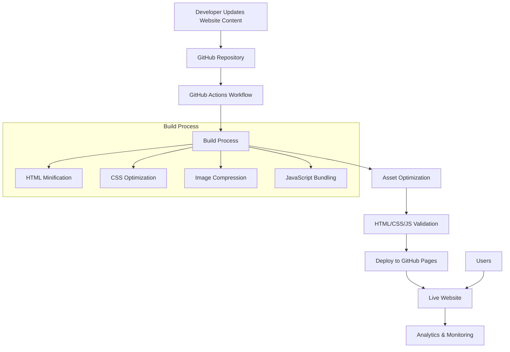
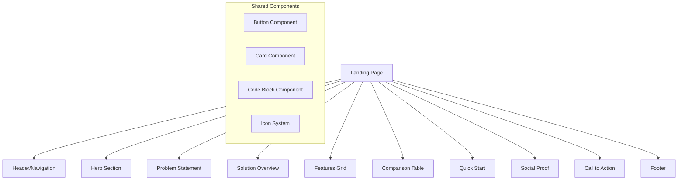

# Design Document: Awesome Landing Page

## Overview

This design outlines the creation of a modern, high-performance landing page for OptipOd with automated GitHub Pages deployment. The solution enhances the existing landing page with improved design, performance optimizations, and a robust CI/CD pipeline for seamless updates.

The design focuses on three core pillars:
1. **User Experience**: Modern, responsive design that clearly communicates OptipOd's value proposition
2. **Performance**: Fast loading times and optimal Core Web Vitals scores
3. **Automation**: Seamless deployment pipeline triggered by content changes

## Architecture

### High-Level Architecture



### Component Architecture

The landing page follows a modular, component-based structure:



## Components and Interfaces

### 1. Enhanced Landing Page Components

#### Hero Section Enhancement
- **Current State**: Basic hero with text and CTA buttons
- **Enhanced Design**: 
  - Animated gradient background with subtle particle effects
  - Dynamic GitHub statistics (stars, forks, releases) fetched via GitHub API
  - Interactive demo or animated illustration showing OptipOd in action
  - Improved typography hierarchy with custom font loading

#### Features Grid Redesign
- **Interactive Cards**: Hover effects with micro-animations
- **Icon System**: Custom SVG icons for each feature
- **Progressive Disclosure**: Expandable cards for detailed feature descriptions
- **Visual Hierarchy**: Clear categorization of features by importance

#### Comparison Table Enhancement
- **Interactive Elements**: Expandable rows for detailed comparisons
- **Visual Indicators**: Color-coded checkmarks and status indicators
- **Responsive Design**: Horizontal scrolling on mobile with sticky headers
- **Tooltips**: Contextual explanations for technical terms

#### Code Examples Component
- **Syntax Highlighting**: Prism.js integration for YAML/Bash highlighting
- **Copy-to-Clipboard**: One-click copying of code snippets
- **Tabbed Interface**: Multiple examples (basic, advanced, production)
- **Live Validation**: Real-time YAML syntax validation

### 2. Performance Optimization Layer

#### Asset Optimization Pipeline
```typescript
interface AssetOptimization {
  images: {
    formats: ['webp', 'avif', 'jpg'];
    sizes: [320, 640, 1024, 1920];
    quality: 85;
    lazyLoading: true;
  };
  css: {
    minification: true;
    purging: true;
    criticalCSS: true;
  };
  javascript: {
    minification: true;
    bundling: true;
    treeshaking: true;
  };
}
```

#### Loading Strategy
- **Critical CSS Inlining**: Above-the-fold styles inlined in HTML
- **Resource Hints**: Preload, prefetch, and preconnect directives
- **Progressive Enhancement**: Core functionality works without JavaScript
- **Service Worker**: Caching strategy for repeat visits

### 3. GitHub Actions Deployment Pipeline

#### Workflow Architecture
```yaml
# Simplified workflow structure
name: Deploy Landing Page
on:
  push:
    paths: ['website/**']
    branches: [main]

jobs:
  build-and-deploy:
    runs-on: ubuntu-latest
    steps:
      - checkout
      - setup-node
      - install-dependencies
      - run-tests
      - optimize-assets
      - validate-html
      - deploy-to-pages
```

#### Build Process Components
- **HTML Validator**: W3C HTML validation
- **CSS Linter**: Stylelint for CSS quality
- **Accessibility Checker**: axe-core for a11y compliance
- **Performance Auditor**: Lighthouse CI integration
- **Link Checker**: Validate all external links

## Data Models

### 1. GitHub API Integration

```typescript
interface GitHubStats {
  stars: number;
  forks: number;
  watchers: number;
  releases: Release[];
  contributors: number;
  lastUpdated: Date;
}

interface Release {
  tagName: string;
  name: string;
  publishedAt: Date;
  downloadCount: number;
}
```

### 2. Analytics Data Model

```typescript
interface AnalyticsEvent {
  eventName: string;
  category: 'navigation' | 'cta' | 'engagement';
  label?: string;
  value?: number;
  timestamp: Date;
}

interface PageMetrics {
  loadTime: number;
  firstContentfulPaint: number;
  largestContentfulPaint: number;
  cumulativeLayoutShift: number;
  firstInputDelay: number;
}
```

### 3. Content Management Structure

```typescript
interface PageContent {
  hero: {
    title: string;
    subtitle: string;
    ctaButtons: CTAButton[];
  };
  features: Feature[];
  testimonials: Testimonial[];
  quickStart: {
    steps: Step[];
    codeExamples: CodeExample[];
  };
}

interface Feature {
  id: string;
  title: string;
  description: string;
  icon: string;
  category: 'core' | 'advanced' | 'enterprise';
}
```

## Correctness Properties

*A property is a characteristic or behavior that should hold true across all valid executions of a system—essentially, a formal statement about what the system should do. Properties serve as the bridge between human-readable specifications and machine-verifiable correctness guarantees.*

### Property 1: Performance Threshold Compliance
*For any* page load on the landing page, the Lighthouse performance score should be 90 or higher.
**Validates: Requirements 3.1**

### Property 2: Accessibility Threshold Compliance
*For any* page load on the landing page, the Lighthouse accessibility score should be 95 or higher.
**Validates: Requirements 3.2**

### Property 3: Responsive Design Consistency
*For any* viewport size between 320px and 1920px width, all content should remain accessible and properly formatted without horizontal scrolling.
**Validates: Requirements 1.3**

### Property 4: Comprehensive Accessibility Compliance
*For any* interactive element on the page, it should be keyboard navigable, have appropriate ARIA labels, and all images should have descriptive alt text.
**Validates: Requirements 3.3, 3.4, 3.5**

### Property 5: SEO Meta Tags Completeness
*For any* page on the website, it should include all required SEO meta tags (title, description, Open Graph, Twitter Cards, canonical URL) with appropriate content.
**Validates: Requirements 5.1, 5.2, 5.3, 5.5, 5.6, 5.7**

### Property 6: Link Integrity and Navigation
*For any* link on the landing page (internal navigation or external), it should be functional and return successful responses.
**Validates: Requirements 1.4, 1.6, 2.8, 7.4**

### Property 7: Asset Optimization Effectiveness
*For any* static asset (images, CSS, JavaScript) on the page, it should be optimized for performance with appropriate compression and modern formats.
**Validates: Requirements 3.6, 3.7**

### Property 8: Deployment Pipeline Automation
*For any* change to files in the website/ directory, the deployment pipeline should trigger automatically and complete successfully within 5 minutes.
**Validates: Requirements 4.1, 4.2**

### Property 9: Build Validation Completeness
*For any* deployment build, all validation steps (HTML, CSS, JavaScript, accessibility) should pass before deployment proceeds.
**Validates: Requirements 4.3, 4.4, 4.5**

### Property 10: Content Synchronization Accuracy
*For any* dynamic content (GitHub statistics, version information), the displayed data should be current and accurately reflect the source.
**Validates: Requirements 1.7, 7.2, 7.3**

### Property 11: User Interaction Tracking
*For any* key user interaction (CTA clicks, section navigation), appropriate analytics events should be fired for tracking.
**Validates: Requirements 6.2, 6.4**

## Error Handling

### Build Pipeline Error Handling
- **Validation Failures**: Stop deployment and provide detailed error reports
- **Asset Optimization Errors**: Fallback to unoptimized assets with warnings
- **External API Failures**: Use cached data or graceful degradation
- **Deployment Failures**: Automatic rollback to previous version

### Runtime Error Handling
- **JavaScript Errors**: Non-blocking error reporting to analytics
- **Image Loading Failures**: Fallback to placeholder images
- **API Timeouts**: Show cached data with refresh option
- **Network Issues**: Offline-first approach with service worker

### User Experience Error Handling
- **Slow Loading**: Progressive loading indicators
- **Failed Interactions**: Clear error messages and retry options
- **Accessibility Issues**: Keyboard navigation fallbacks
- **Mobile Issues**: Touch-friendly error recovery

## Testing Strategy

### Dual Testing Approach
The testing strategy combines unit tests for specific functionality and property-based tests for comprehensive coverage:

**Unit Tests**:
- Component rendering and interaction tests
- Build pipeline step validation
- API integration error scenarios
- Accessibility compliance checks

**Property-Based Tests**:
- Performance threshold validation across different conditions
- Responsive design consistency across viewport ranges
- Link integrity across all external references
- Content synchronization accuracy over time

### Testing Configuration
- **Property Tests**: Minimum 100 iterations per test using fast-check library
- **Performance Tests**: Lighthouse CI with configurable thresholds
- **Accessibility Tests**: axe-core integration in CI pipeline
- **Cross-browser Tests**: Playwright for major browser compatibility

### Test Automation
- **Pre-deployment**: All tests run before GitHub Pages deployment
- **Continuous Monitoring**: Performance and accessibility monitoring in production
- **Regression Testing**: Automated visual regression tests for design changes
- **Load Testing**: Simulated traffic tests for performance validation

Each property-based test will be tagged with: **Feature: awesome-landing-page, Property {number}: {property_text}**