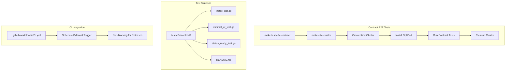

# Contract E2E Testing Design Document

## Overview

This design outlines the implementation of a contract-based E2E testing model for OptiPod that focuses on minimal, deterministic, and fast validation of user-visible behavior. The contract-based approach validates only essential user contracts without testing internal controller behavior, timing-sensitive assertions, or exact resource values. This approach ensures stable, reproducible tests that complete in under 10 minutes and do not block releases.

## Architecture

### Current State
- Comprehensive E2E tests in `test/e2e/` that validate all OptiPod features
- E2E tests included in release pipeline as blocking steps
- Tests depend on code generation, formatting, and static analysis
- Tests can be flaky due to timing-sensitive assertions and internal behavior validation

### Target State
- Contract-based E2E tests in `test/e2e/contract/` directory
- Separate GitHub Actions workflow for contract tests (non-blocking for releases)
- Clean Makefile targets for contract testing
- Hermetic test execution with dedicated Kind clusters
- Fast execution (under 10 minutes) with minimal assertions

### Contract Testing Architecture



## Components and Interfaces

### Makefile Targets

#### Contract E2E Target
```makefile
.PHONY: test-e2e-contract
test-e2e-contract: e2e-cluster ## Run contract-based E2E tests
	go test ./test/e2e/contract -v -timeout=10m

.PHONY: e2e-cluster
e2e-cluster: ## Create clean Kind cluster for contract testing
	kind delete cluster --name optipod-e2e || true
	kind create cluster --name optipod-e2e
```

### Test Structure Components

#### ContractTestSuite
```go
type ContractTestSuite struct {
    client     client.Client
    kubeconfig string
    namespace  string
    timeout    time.Duration
}

// SetupSuite initializes the test environment
func (s *ContractTestSuite) SetupSuite() error

// TeardownSuite cleans up the test environment
func (s *ContractTestSuite) TeardownSuite() error

// InstallOptiPod deploys OptiPod to the cluster
func (s *ContractTestSuite) InstallOptiPod() error

// CreateMinimalCR creates a minimal OptimizationPolicy
func (s *ContractTestSuite) CreateMinimalCR() (*v1alpha1.OptimizationPolicy, error)

// WaitForReadyCondition polls for Ready=True condition
func (s *ContractTestSuite) WaitForReadyCondition(name string) error
```

#### Installation Helper
```go
type InstallationHelper struct {
    client    client.Client
    namespace string
}

// DeployManifests applies OptiPod manifests to cluster
func (h *InstallationHelper) DeployManifests() error

// WaitForControllerReady waits for controller pod to be ready
func (h *InstallationHelper) WaitForControllerReady(timeout time.Duration) error

// VerifyNoCrashLoop checks for pod restart events
func (h *InstallationHelper) VerifyNoCrashLoop() error
```

#### CR Helper
```go
type CRHelper struct {
    client client.Client
}

// CreateMinimalOptimizationPolicy creates CR with only required fields
func (h *CRHelper) CreateMinimalOptimizationPolicy(name, namespace string) (*v1alpha1.OptimizationPolicy, error)

// WaitForAPIAcceptance verifies CR is accepted by API server
func (h *CRHelper) WaitForAPIAcceptance(name, namespace string) error

// PollForReadyCondition polls status for Ready=True condition
func (h *CRHelper) PollForReadyCondition(name, namespace string, timeout time.Duration) error
```

#### Cluster Helper
```go
type ClusterHelper struct {
    clusterName string
}

// CreateKindCluster creates a new Kind cluster
func (h *ClusterHelper) CreateKindCluster() error

// DeleteKindCluster removes the Kind cluster
func (h *ClusterHelper) DeleteKindCluster() error

// GetKubeconfig returns kubeconfig for the cluster
func (h *ClusterHelper) GetKubeconfig() (string, error)
```

## Data Models

### Contract Test Configuration

```go
type ContractTestConfig struct {
    ClusterName     string
    Namespace       string
    Timeout         time.Duration
    PollInterval    time.Duration
    ManifestPath    string
    KubeconfigPath  string
}

type MinimalCRSpec struct {
    Name      string
    Namespace string
    Mode      string // Only required fields
}

type InstallationStatus struct {
    ControllerReady bool
    CRDsInstalled   bool
    NoErrors        bool
}

type ContractValidation struct {
    InstallationPassed bool
    CRAccepted         bool
    StatusConverged    bool
    ExecutionTime      time.Duration
}
```

### Test Result Models

```go
type ContractTestResult struct {
    TestName      string
    Status        TestStatus
    Duration      time.Duration
    ErrorMessage  string
    Artifacts     []string
}

type TestStatus string
const (
    TestStatusPassed TestStatus = "passed"
    TestStatusFailed TestStatus = "failed"
    TestStatusSkipped TestStatus = "skipped"
)

type TestSummary struct {
    TotalTests    int
    PassedTests   int
    FailedTests   int
    SkippedTests  int
    TotalDuration time.Duration
}
```

## Correctness Properties

*A property is a characteristic or behavior that should hold true across all valid executions of a system-essentially, a formal statement about what the system should do. Properties serve as the bridge between human-readable specifications and machine-verifiable correctness guarantees.*

### Property Reflection

After reviewing all properties identified in the prework, several can be consolidated:
- Properties 1.1, 1.2, 1.3 can be combined into a comprehensive test execution lifecycle property
- Properties 2.1, 2.2, 2.3, 2.4, 2.5 can be combined into a contract validation scope property
- Properties 4.1, 4.2, 4.3, 4.4, 4.5 can be combined into an installation validation property
- Properties 5.1, 5.2, 5.3, 5.4, 5.5 can be combined into a minimal CR validation property
- Properties 6.1, 6.2, 6.3, 6.4, 6.5 can be combined into a status convergence property
- Properties 7.1, 7.2, 7.3, 7.4, 7.5 can be combined into a Ginkgo best practices property
- Properties 8.1, 8.3, 8.4, 8.5 can be combined into a build system property
- Properties 10.1, 10.2, 10.3, 10.4, 10.5 can be combined into a local execution consistency property

Property 1: Test execution lifecycle
*For any* contract E2E test execution, the test suite should complete within 10 minutes, create its own Kind cluster for isolation, and clean up automatically upon completion
**Validates: Requirements 1.1, 1.2, 1.3**

Property 2: Contract validation scope
*For any* contract test validation, the test should only verify user-visible behavior (pod readiness, CR acceptance, Ready condition) and never assert internal details like reconcile counts, logs, or exact resource values
**Validates: Requirements 2.1, 2.2, 2.3, 2.4, 2.5**

Property 3: Error message quality
*For any* contract test failure, the error message should be actionable and not contain internal implementation details
**Validates: Requirements 1.4**

Property 4: Test determinism
*For any* contract test execution environment (local or CI), the test results should be identical
**Validates: Requirements 1.5**

Property 5: Release pipeline separation
*For any* contract test failure, the failure should not prevent release deployment
**Validates: Requirements 3.3**

Property 6: Test result reporting
*For any* contract test execution, the test suite should provide clear pass/fail status
**Validates: Requirements 3.5**

Property 7: Installation validation
*For any* OptiPod installation test, the test should apply manifests to a clean cluster, wait for controller readiness, verify no crashloops, and not assert specific configuration details
**Validates: Requirements 4.1, 4.2, 4.3, 4.4, 4.5**

Property 8: Minimal CR validation
*For any* minimal CR test, the CR should contain only required fields, be accepted by the API server, produce no validation errors, and not include optional fields or specific value assertions
**Validates: Requirements 5.1, 5.2, 5.3, 5.4, 5.5**

Property 9: Status convergence validation
*For any* status convergence test, the test should use Eventually with 2-minute timeout, poll at 5-second intervals, verify Ready=True condition, and not assert detailed status messages or timing
**Validates: Requirements 6.1, 6.2, 6.3, 6.4, 6.5**

Property 10: Ginkgo best practices
*For any* contract test implementation, the test should use one assertion per It block, use Eventually for async behavior, avoid nested Eventually calls, maintain test isolation, and use descriptive names
**Validates: Requirements 7.1, 7.2, 7.3, 7.4, 7.5**

Property 11: Build system behavior
*For any* contract test build target execution, the system should run only contract tests, create fresh clusters, exclude code generation dependencies, and preserve existing comprehensive test targets
**Validates: Requirements 8.1, 8.3, 8.4, 8.5**

Property 12: Directory organization
*For any* contract test organization, the tests should be in test/e2e/contract/ directory and maintain clear separation from comprehensive tests
**Validates: Requirements 9.4, 9.5**

Property 13: Local execution consistency
*For any* local contract test execution, the test should create its own cluster, produce same results as CI, clean up automatically, require no manual setup, and use consistent timeout/polling behavior
**Validates: Requirements 10.1, 10.2, 10.3, 10.4, 10.5**

Now I need to use the prework tool to analyze the acceptance criteria before writing the correctness properties:

<function_calls>
<invoke name="prework">
<parameter name="featureName">contract-e2e-testing

## Error Handling

### Test Failure Handling
- Contract tests should fail fast with clear, actionable error messages
- Error messages must not expose internal implementation details
- Failed tests should not prevent other tests from running
- Test failures should be reported with appropriate exit codes for CI integration

### Resource Cleanup
- Automatic cleanup of Kind clusters after test completion
- Cleanup should occur even if tests fail
- No orphaned resources should remain after test execution
- Graceful handling of cleanup failures

### Timeout Management
- Hard timeout of 10 minutes for entire test suite
- Individual test timeouts appropriate for contract validation
- Eventually blocks with 2-minute maximum timeout
- Clear timeout error messages without internal details

### CI Integration Error Handling
- Contract test failures should not block releases
- Clear separation between contract test failures and release-blocking failures
- Proper error reporting for debugging without exposing internals

## Testing Strategy

### Dual Testing Approach

The contract E2E testing will use both unit testing principles and property-based testing concepts:

**Unit Testing Approach:**
- Specific test scenarios that validate concrete contracts
- Example-based testing for directory structure and file existence
- Integration testing for CI workflow configuration
- Regression testing for contract violations

**Property-Based Testing Approach:**
- Use Ginkgo's table-driven tests to validate properties across multiple scenarios
- Generate test configurations to cover various contract validation scenarios
- Validate universal properties that should hold across all contract test executions
- Each property-based test should run with multiple test scenarios

**Property-Based Testing Requirements:**
- Use Ginkgo's `DescribeTable` and `Entry` functions for property-based scenarios
- Configure each property-based test to run with at least 5 different test scenarios
- Tag each property-based test with comments referencing the design document property
- Use this exact format: `**Feature: contract-e2e-testing, Property {number}: {property_text}**`
- Each correctness property must be implemented by a single property-based test

**Testing Framework:**
- Primary framework: Ginkgo v2 for BDD-style test organization
- Assertion library: Gomega for expressive assertions
- Kubernetes testing: Kind clusters for real Kubernetes environment
- Property generation: Custom generators for contract test scenarios

**Test Organization:**
- Group contract tests into logical contexts using Ginkgo's `Context` blocks
- Use `BeforeEach` and `AfterEach` for test setup and cleanup
- Implement helper functions for common contract validation operations
- Use table-driven tests for scenarios with multiple similar test cases

**Test Execution:**
- Tests should be runnable both locally and in CI environments
- Support for isolated test execution with dedicated Kind clusters
- Configurable test timeouts based on contract requirements
- Proper test isolation to prevent interference between contract validations

**Contract Validation Strategy:**
- Focus on user-visible behavior only
- Avoid internal implementation details
- Use minimal assertions that validate essential contracts
- Ensure tests are deterministic and reproducible
- Maintain fast execution times (under 10 minutes total)