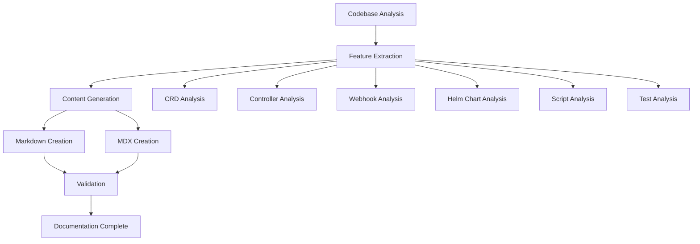
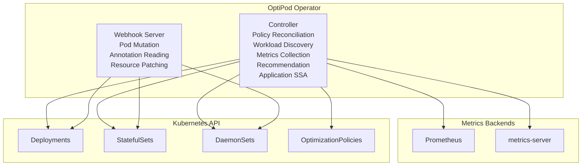
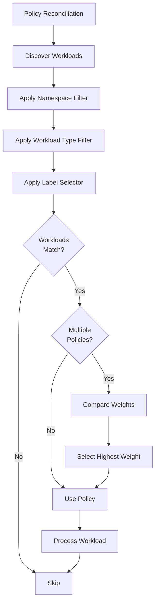
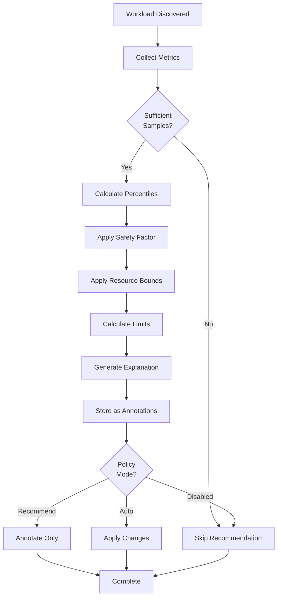

# Design Document: OptiPod Documentation Rebuild

## Overview

This design outlines the approach for building complete OptiPod documentation from scratch by analyzing the actual codebase. The documentation will be created in both Markdown (docs/) and MDX (website/) formats, following the Diátaxis framework for optimal user experience.

### Goals

1. Create accurate documentation based solely on codebase analysis
2. Implement dual documentation (docs/ and website/) with synchronized content
3. Follow Diátaxis framework (tutorials, guides, reference, explanation)
4. Ensure all code examples are executable and accurate
5. Provide comprehensive coverage of all 47+ features

### Non-Goals

1. Referencing or analyzing existing documentation
2. Creating documentation for unimplemented features
3. Making assumptions about behavior not evident in code

## Architecture

### Documentation Generation Pipeline



### Documentation Structure

```
docs/                           website/src/content/docs/
├── getting-started/            ├── getting-started/
│   ├── installation.md         │   ├── installation.mdx
│   ├── quick-start.md          │   ├── quick-start.mdx
│   └── first-policy.md         │   └── first-policy.mdx
├── concepts/                   ├── concepts/
│   ├── architecture.md         │   ├── architecture.mdx
│   ├── modes.md                │   ├── modes.mdx
│   ├── safety-model.md         │   ├── safety-model.mdx
│   └── update-strategies.md    │   └── update-strategies.mdx
├── guides/                     ├── guides/
│   ├── creating-policies.md    │   ├── creating-policies.mdx
│   ├── reviewing-recs.md       │   ├── reviewing-recs.mdx
│   ├── switching-to-auto.md    │   ├── switching-to-auto.mdx
│   ├── troubleshooting.md      │   ├── troubleshooting.mdx
│   └── gitops-integration.md   │   └── gitops-integration.mdx
├── reference/                  ├── reference/
│   ├── crd-spec.md             │   ├── crd-spec.mdx
│   ├── annotations.md          │   ├── annotations.mdx
│   ├── metrics.md              │   ├── metrics.mdx
│   ├── cli-tools.md            │   ├── cli-tools.mdx
│   └── helm-values.md          │   └── helm-values.mdx
└── advanced/                   └── advanced/
    ├── rbac.md                     ├── rbac.mdx
    ├── webhook-config.md           ├── webhook-config.mdx
    ├── operations.md               ├── operations.mdx
    ├── observability.md            ├── observability.mdx
    └── performance.md              └── performance.mdx
```

## Components and Interfaces

### 1. Codebase Analyzer

**Purpose:** Extract information from source code, tests, and configuration files.

**Interface:**
```go
type CodebaseAnalyzer interface {
    AnalyzeCRD(path string) (*CRDSpec, error)
    AnalyzeController(path string) (*ControllerInfo, error)
    AnalyzeWebhook(path string) (*WebhookInfo, error)
    AnalyzeHelmChart(path string) (*HelmChartInfo, error)
    AnalyzeScripts(path string) ([]ScriptInfo, error)
    AnalyzeTests(path string) (*TestInfo, error)
}
```

**Implementation Details:**
- Parse Go source files using `go/parser` and `go/ast`
- Extract struct tags, comments, and field definitions
- Parse YAML files for Helm charts and Kubernetes manifests
- Analyze shell scripts for usage patterns
- Extract test scenarios from test files

### 2. Feature Extractor

**Purpose:** Identify and categorize features from analyzed code.

**Interface:**
```go
type FeatureExtractor interface {
    ExtractFeatures(analysis *CodebaseAnalysis) ([]Feature, error)
    CategorizeFeatures(features []Feature) (*FeatureCategories, error)
    PrioritizeFeatures(features []Feature) ([]Feature, error)
}
```

**Feature Categories:**
- Core Features (CRD, Policy Management, Workload Discovery)
- Metrics Collection (Prometheus, metrics-server)
- Application Strategies (SSA, Webhook)
- Safety Features (Bounds, Memory Safety)
- Observability (Metrics, Logging, Events)
- Deployment (Helm, RBAC, Security)

### 3. Content Generator

**Purpose:** Generate documentation content from extracted features.

**Interface:**
```go
type ContentGenerator interface {
    GenerateTutorial(feature Feature) (*Document, error)
    GenerateGuide(feature Feature) (*Document, error)
    GenerateReference(feature Feature) (*Document, error)
    GenerateExplanation(feature Feature) (*Document, error)
}
```

**Content Types:**
- **Tutorials:** Step-by-step learning experiences
- **Guides:** Task-oriented how-to instructions
- **Reference:** Technical specifications and API docs
- **Explanation:** Conceptual understanding and architecture

### 4. Dual Format Writer

**Purpose:** Write documentation in both Markdown and MDX formats.

**Interface:**
```go
type DualFormatWriter interface {
    WriteMarkdown(doc *Document, path string) error
    WriteMDX(doc *Document, path string) error
    SyncContent(mdPath, mdxPath string) error
}
```

**Synchronization Strategy:**
- Generate content once in neutral format
- Transform to Markdown for docs/
- Transform to MDX for website/
- Ensure examples and commands are identical
- Adapt formatting for each medium

### 5. Validator

**Purpose:** Validate documentation accuracy and completeness.

**Interface:**
```go
type Validator interface {
    ValidateScriptReferences(doc *Document) ([]ValidationError, error)
    ValidateAnnotationFormats(doc *Document) ([]ValidationError, error)
    ValidateCodeExamples(doc *Document) ([]ValidationError, error)
    ValidateLinks(doc *Document) ([]ValidationError, error)
}
```

**Validation Checks:**
- Script names exist in scripts/ directory
- Annotation formats match controller code
- URLs are correctly constructed
- Helm values exist in values.yaml
- CRD fields exist in types.go
- Code examples are syntactically correct

## Data Models

### CRD Specification Model

```go
type CRDSpec struct {
    Name        string
    Group       string
    Version     string
    Kind        string
    Fields      []FieldSpec
    Examples    []string
    Validation  ValidationRules
}

type FieldSpec struct {
    Name        string
    Type        string
    Description string
    Required    bool
    Default     interface{}
    Validation  string
    Example     interface{}
}
```

### Feature Model

```go
type Feature struct {
    ID          string
    Name        string
    Category    string
    Description string
    CodePaths   []string
    TestPaths   []string
    Examples    []Example
    Priority    int
    DiátaxisType string // tutorial, guide, reference, explanation
}

type Example struct {
    Title       string
    Description string
    Code        string
    Language    string
    FilePath    string
}
```

### Document Model

```go
type Document struct {
    Title       string
    Category    string
    DiátaxisType string
    Sections    []Section
    CodeBlocks  []CodeBlock
    Diagrams    []Diagram
    Links       []Link
}

type Section struct {
    Title       string
    Content     string
    Level       int
    Subsections []Section
}

type CodeBlock struct {
    Language    string
    Code        string
    Caption     string
    FilePath    string // Source file for verification
}

type Diagram struct {
    Type        string // mermaid, image
    Content     string
    Caption     string
    AltText     string
}
```

## Correctness Properties

*A property is a characteristic or behavior that should hold true across all valid executions of a system—essentially, a formal statement about what the system should do. Properties serve as the bridge between human-readable specifications and machine-verifiable correctness guarantees.*

### Property 1: Codebase Discovery Completeness

*For any* source directory (api/, internal/, cmd/, scripts/, charts/, config/, test/), the analyzer must discover and process all relevant files in that directory.

**Validates: Requirements 1.1, 1.2, 1.3, 1.4**

### Property 2: Feature Extraction Completeness

*For any* feature implemented in the codebase (CRD field, annotation, metric, script, Helm value), the feature must be extracted and included in the feature list.

**Validates: Requirements 2.2, 3.4, 4.1, 5.2, 6.2, 12.1, 12.2, 12.3, 12.4, 12.5**

### Property 3: Script Reference Accuracy

*For any* documentation file that references a script, the script name must exist as an actual file in the scripts/ directory.

**Validates: Requirements 4.1, 17.1**

### Property 4: Annotation Format Consistency

*For any* annotation example in documentation, the annotation key format must match the format used in internal/controller/ code and scripts/optipod-recommendation-report.sh.

**Validates: Requirements 3.2, 3.3, 17.2**

### Property 5: CRD Field Accuracy

*For any* CRD field documented in reference documentation, the field must exist in api/v1alpha1/optimizationpolicy_types.go with matching name, type, validation rules, default value, and required/optional status.

**Validates: Requirements 2.1, 2.2, 2.3, 2.5, 17.5**

### Property 6: Helm Value Accuracy

*For any* Helm configuration value documented, the value must exist in charts/optipod/values.yaml with matching path, default value, type, and required/optional status.

**Validates: Requirements 5.1, 5.3, 5.5, 17.4**

### Property 7: Metrics Documentation Accuracy

*For any* Prometheus metric documented, the metric must be defined in internal/ code with matching name, type, labels, and description.

**Validates: Requirements 6.1, 6.2, 6.3, 6.4**

### Property 8: Dual Documentation Synchronization

*For any* documentation topic, the content in docs/ (Markdown) and website/ (MDX) must cover the same information with identical code examples, commands, and script references.

**Validates: Requirements 7.1, 7.2, 7.5**

### Property 9: Code Example Source Accuracy

*For any* code example in documentation (policy YAML, kubectl command, Helm command, script usage), the example must be derived from actual files in config/samples/, scripts/, or charts/ directories, or be syntactically valid for its type.

**Validates: Requirements 3.5, 4.5, 14.3, 15.1, 15.4**

### Property 10: Code Example Executability

*For any* code example in documentation, the example must be syntactically correct and executable in the appropriate environment (kubectl, helm, bash).

**Validates: Requirements 15.2, 15.3, 15.5**

### Property 11: URL Construction Correctness

*For any* download URL in documentation, the URL must be constructed from the actual file path in the repository and point to an existing file.

**Validates: Requirements 4.4, 17.3**

### Property 12: Internal Link Validity

*For any* internal link in documentation, the link must point to an existing document in the same documentation set (docs/ or website/).

**Validates: Requirements 7.5, 16.3**

### Property 13: Documentation-Code Alignment

*For any* documented behavior (architecture, modes, safety model, update strategies, policy selection, RBAC, webhook configuration), the documentation must accurately reflect the actual implementation in the corresponding code directories.

**Validates: Requirements 10.1, 10.2, 10.3, 10.4, 10.5, 13.1, 13.2, 13.3, 13.4, 13.5**

### Property 14: Diátaxis Category Consistency

*For any* document, the content must match its declared Diátaxis category (learning-oriented in tutorials, task-oriented in guides, information-oriented in reference, understanding-oriented in explanations).

**Validates: Requirements 8.1, 8.2, 8.3, 8.4, 8.5**

### Property 15: Diagram Accessibility

*For any* diagram in documentation, the diagram must have a descriptive caption and alt text for accessibility.

**Validates: Requirements 14.4**

### Property 16: Long Document Navigation

*For any* document exceeding 500 lines or 5000 words, the document must include a table of contents.

**Validates: Requirements 16.2**

## Error Handling

### Codebase Analysis Errors

**Error Types:**
- File not found
- Parse errors (Go, YAML, shell)
- Invalid syntax
- Missing required fields

**Handling Strategy:**
- Log detailed error with file path and line number
- Skip malformed files with warning
- Continue processing other files
- Report all errors at end of analysis

### Content Generation Errors

**Error Types:**
- Missing required information
- Conflicting information from multiple sources
- Template rendering errors
- Invalid Mermaid diagram syntax

**Handling Strategy:**
- Use placeholder text with TODO markers
- Log warning with context
- Generate partial content
- Create issue list for manual review

### Validation Errors

**Error Types:**
- Script reference to non-existent file
- Annotation format mismatch
- Invalid URL
- Broken internal link
- Code example syntax error

**Handling Strategy:**
- Fail validation with detailed error report
- Provide fix suggestions
- Block documentation publication
- Require manual correction

## Testing Strategy

### Unit Testing

**Test Coverage:**
- Codebase analyzer for each file type (Go, YAML, shell)
- Feature extractor categorization logic
- Content generator template rendering
- Validator rule checking
- Dual format writer synchronization

**Example Tests:**
```go
func TestCRDAnalyzer_ExtractsAllFields(t *testing.T)
func TestFeatureExtractor_CategorizesCorrectly(t *testing.T)
func TestValidator_DetectsInvalidScriptReference(t *testing.T)
func TestDualWriter_SynchronizesContent(t *testing.T)
```

### Integration Testing

**Test Scenarios:**
- End-to-end documentation generation from sample codebase
- Validation of generated documentation
- Dual format synchronization
- Link checking across all documents

**Example Tests:**
```go
func TestDocumentationGeneration_EndToEnd(t *testing.T)
func TestValidation_AllPropertiesPass(t *testing.T)
func TestDualFormat_ContentMatches(t *testing.T)
```

### Property-Based Testing

**Properties to Test:**
- Script reference accuracy (Property 1)
- Annotation format consistency (Property 2)
- CRD field completeness (Property 3)
- Helm value accuracy (Property 4)
- Code example executability (Property 6)

**Example Property Tests:**
```go
func TestProperty_ScriptReferencesExist(t *testing.T)
func TestProperty_AnnotationFormatsMatch(t *testing.T)
func TestProperty_CRDFieldsComplete(t *testing.T)
```

### Manual Testing

**Test Checklist:**
- [ ] Install OptiPod using installation documentation
- [ ] Follow quick start guide end-to-end
- [ ] Create policy using guide
- [ ] Review recommendations using guide
- [ ] Verify all code examples work
- [ ] Check all links navigate correctly
- [ ] Verify diagrams render properly
- [ ] Test search functionality (website)
- [ ] Verify mobile responsiveness (website)

## Implementation Phases

### Phase 1: Codebase Analysis (Foundation)

**Deliverables:**
- CRD specification extraction
- Controller behavior analysis
- Webhook implementation analysis
- Helm chart configuration extraction
- Script inventory and analysis
- Test scenario extraction

### Phase 2: Feature Extraction and Categorization

**Deliverables:**
- Complete feature list (47+ features)
- Feature categorization by Diátaxis type
- Feature prioritization by user impact
- Example extraction from code and tests

### Phase 3: Core Documentation (Getting Started + Concepts)

**Deliverables:**
- Installation guide
- Quick start tutorial
- First policy guide
- Architecture explanation
- Modes explanation
- Safety model explanation
- Update strategies explanation

### Phase 4: Task-Oriented Guides

**Deliverables:**
- Creating policies guide
- Reviewing recommendations guide
- Switching to Auto mode guide
- Troubleshooting guide
- GitOps integration guide

### Phase 5: Reference Documentation

**Deliverables:**
- Complete CRD specification
- Annotation reference
- Metrics reference
- CLI tools reference
- Helm values reference

### Phase 6: Advanced Topics

**Deliverables:**
- RBAC configuration guide
- Webhook configuration guide
- Operations runbook
- Observability setup guide
- Performance tuning guide

### Phase 7: Validation and Polish

**Deliverables:**
- All validation properties passing
- All links working
- All code examples tested
- Diagrams complete and accessible
- Navigation structure finalized
- Search functionality working (website)

## Diagram Specifications

### Architecture Diagram



### Policy Selection Flow



### Recommendation Flow



## Security Considerations

### Documentation Security

1. **No Secrets in Examples:** Ensure all examples use placeholder values for sensitive data
2. **RBAC Best Practices:** Document least-privilege RBAC configurations
3. **TLS Configuration:** Document secure TLS setup for webhook and Prometheus
4. **Secret Management:** Document proper secret handling for credentials

### Build Security

1. **No Credential Exposure:** Ensure documentation build process doesn't expose credentials
2. **Dependency Scanning:** Scan documentation build dependencies
3. **Access Control:** Restrict who can publish documentation

## Performance Considerations

### Documentation Build Performance

1. **Parallel Processing:** Analyze multiple files concurrently
2. **Caching:** Cache parsed AST and analysis results
3. **Incremental Builds:** Only regenerate changed documents
4. **Lazy Loading:** Load large files only when needed

### Website Performance

1. **Static Generation:** Pre-render all pages at build time
2. **Image Optimization:** Optimize all screenshots and diagrams
3. **Code Splitting:** Split JavaScript bundles for faster loading
4. **CDN Delivery:** Serve static assets from CDN

## Maintenance and Updates

### Documentation Update Process

1. **Code Changes:** When code changes, identify affected documentation
2. **Regeneration:** Regenerate affected documentation from updated code
3. **Validation:** Run all validation properties
4. **Review:** Manual review of changes
5. **Publication:** Deploy updated documentation

### Continuous Validation

1. **CI Integration:** Run validation on every commit
2. **Link Checking:** Check all links daily
3. **Example Testing:** Test all code examples weekly
4. **Screenshot Updates:** Update screenshots quarterly

### Version Management

1. **Version Tagging:** Tag documentation with OptiPod version
2. **Version Selector:** Allow users to view docs for different versions
3. **Deprecation Notices:** Mark deprecated features clearly
4. **Migration Guides:** Provide upgrade guides between versions
