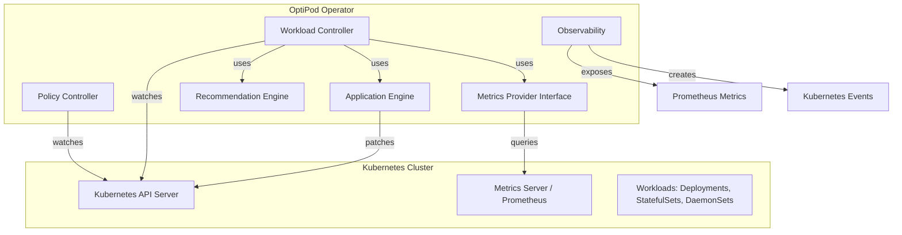

# Design Document

## Overview

OptiPod is a Kubernetes operator built using the controller-runtime framework that continuously monitors workload resource usage and automatically adjusts CPU and memory requests to match actual consumption patterns. The system follows the Kubernetes operator pattern with custom resources (CRDs) for configuration and uses a reconciliation loop to process workloads.

The architecture separates concerns into distinct layers:
- **Controller Layer**: Manages reconciliation loops and Kubernetes API interactions
- **Metrics Layer**: Abstracts metrics collection from various backends (metrics-server, Prometheus, custom)
- **Recommendation Engine**: Computes optimal resource requests based on usage statistics
- **Application Layer**: Applies changes safely with support for in-place resize and fallback strategies
- **Observability Layer**: Exposes status, events, and Prometheus metrics

## Architecture

### High-Level Component Diagram



### Control Flow

1. **Policy Reconciliation**: Policy Controller watches OptimizationPolicy CRDs and validates configuration
2. **Workload Discovery**: Workload Controller discovers workloads matching policy selectors
3. **Metrics Collection**: Metrics Provider fetches usage data over the configured rolling window
4. **Recommendation Computation**: Recommendation Engine calculates optimal requests using percentiles and safety factors
5. **Bounds Enforcement**: Computed recommendations are clamped to min/max bounds from policy
6. **Application Decision**: Application Engine determines if changes can be applied (in-place, recreate, or skip)
7. **Status Update**: Results are written to policy status and Kubernetes events are emitted

## Components and Interfaces

### 1. Custom Resource Definitions (CRDs)

#### OptimizationPolicy CRD

```yaml
apiVersion: optipod.io/v1alpha1
kind: OptimizationPolicy
metadata:
  name: production-workloads
  namespace: optipod-system
spec:
  # Mode: Auto, Recommend, or Disabled
  mode: Auto
  
  # Target workload selection
  selector:
    namespaceSelector:
      matchLabels:
        environment: production
    workloadSelector:
      matchLabels:
        optimize: "true"
    namespaces:
      allow: ["default", "production"]
      deny: ["kube-system"]
  
  # Metrics configuration
  metricsConfig:
    provider: prometheus  # or metrics-server, custom
    rollingWindow: 24h
    percentile: P90
    safetyFactor: 1.2
  
  # Resource bounds
  resourceBounds:
    cpu:
      min: "100m"
      max: "4000m"
    memory:
      min: "128Mi"
      max: "8Gi"
  
  # Update strategy
  updateStrategy:
    allowInPlaceResize: true
    allowRecreate: false
    updateRequestsOnly: true
  
  # Reconciliation
  reconciliationInterval: 5m

status:
  conditions:
    - type: Ready
      status: "True"
      lastTransitionTime: "2024-01-15T10:00:00Z"
      reason: PolicyValid
      message: "Policy is active and processing workloads"
  
  workloads:
    - name: web-deployment
      namespace: production
      lastRecommendation: "2024-01-15T10:05:00Z"
      lastApplied: "2024-01-15T10:05:00Z"
      recommendations:
        - container: nginx
          cpu: "500m"
          memory: "512Mi"
      status: Applied
```

### 2. Controller Components

#### Policy Controller

**Responsibilities:**
- Watch OptimizationPolicy CRD create/update/delete events
- Validate policy configuration (bounds, selectors, modes)
- Maintain an in-memory cache of active policies
- Emit validation errors as Kubernetes events

**Interface:**
```go
type PolicyController interface {
    Reconcile(ctx context.Context, req reconcile.Request) (reconcile.Result, error)
    ValidatePolicy(policy *OptimizationPolicy) error
}
```

#### Workload Controller

**Responsibilities:**
- Discover workloads matching policy selectors
- Coordinate metrics collection, recommendation, and application
- Update policy status with per-workload results
- Handle reconciliation intervals and requeueing

**Interface:**
```go
type WorkloadController interface {
    Reconcile(ctx context.Context, req reconcile.Request) (reconcile.Result, error)
    DiscoverWorkloads(policy *OptimizationPolicy) ([]Workload, error)
    ProcessWorkload(ctx context.Context, workload Workload, policy *OptimizationPolicy) error
}
```

### 3. Metrics Provider

**Abstraction for pluggable metrics backends:**

```go
type MetricsProvider interface {
    // GetContainerMetrics returns CPU and memory usage statistics for a container
    GetContainerMetrics(ctx context.Context, namespace, podName, containerName string, window time.Duration) (*ContainerMetrics, error)
    
    // HealthCheck verifies the metrics backend is accessible
    HealthCheck(ctx context.Context) error
}

type ContainerMetrics struct {
    CPU    ResourceMetrics
    Memory ResourceMetrics
}

type ResourceMetrics struct {
    P50 resource.Quantity
    P90 resource.Quantity
    P99 resource.Quantity
    Samples int
}
```

**Implementations:**
- **MetricsServerProvider**: Queries Kubernetes metrics-server API
- **PrometheusProvider**: Queries Prometheus using PromQL
- **CustomProvider**: Extensibility point for future backends

### 4. Recommendation Engine

**Responsibilities:**
- Compute optimal resource requests from usage statistics
- Apply safety factors and percentile selection
- Enforce min/max bounds from policy
- Detect when insufficient data is available

**Interface:**
```go
type RecommendationEngine interface {
    ComputeRecommendation(metrics *ContainerMetrics, policy *OptimizationPolicy) (*Recommendation, error)
}

type Recommendation struct {
    CPU    resource.Quantity
    Memory resource.Quantity
    Reason string  // Explanation of how recommendation was computed
}
```

**Algorithm:**
1. Select percentile from metrics (P50, P90, or P99 based on policy)
2. Apply safety factor: `recommendation = percentile * safetyFactor`
3. Clamp to bounds: `max(min, min(recommendation, max))`
4. Return recommendation with explanation

### 5. Application Engine

**Responsibilities:**
- Determine if changes can be applied safely
- Detect in-place resize capability
- Apply patches to workload specs
- Handle RBAC errors gracefully

**Interface:**
```go
type ApplicationEngine interface {
    CanApply(ctx context.Context, workload Workload, recommendation *Recommendation, policy *OptimizationPolicy) (ApplyDecision, error)
    Apply(ctx context.Context, workload Workload, recommendation *Recommendation) error
}

type ApplyDecision struct {
    CanApply bool
    Method   ApplyMethod  // InPlace, Recreate, Skip
    Reason   string
}

type ApplyMethod string
const (
    InPlace  ApplyMethod = "InPlace"
    Recreate ApplyMethod = "Recreate"
    Skip     ApplyMethod = "Skip"
)
```

**Decision Logic:**
1. Check if policy mode is Auto (skip if Recommend or Disabled)
2. Check if global dry-run is enabled (skip if true)
3. Detect if in-place resize is supported and allowed by policy
4. If in-place not available and recreate not allowed, skip
5. Check RBAC permissions
6. Return decision

### 6. Observability

**Prometheus Metrics:**
```go
// Gauges
optipod_workloads_monitored{namespace, policy}
optipod_workloads_updated{namespace, policy}
optipod_workloads_skipped{namespace, policy, reason}

// Histograms
optipod_reconciliation_duration_seconds{policy}
optipod_metrics_collection_duration_seconds{provider}

// Counters
optipod_reconciliation_errors_total{policy, error_type}
optipod_recommendations_total{policy}
optipod_applications_total{policy, method}
```

**Kubernetes Events:**
- Created on workload resources when updates succeed/fail
- Created on policy resources for validation errors
- Include actionable messages and reasons

## Data Models

### Core Types

```go
// Workload represents a Kubernetes resource that manages pods
type Workload struct {
    Kind      string  // Deployment, StatefulSet, DaemonSet
    Namespace string
    Name      string
    Spec      WorkloadSpec
}

type WorkloadSpec struct {
    Containers []Container
}

type Container struct {
    Name      string
    Resources ResourceRequirements
}

type ResourceRequirements struct {
    Requests ResourceList
    Limits   ResourceList
}

type ResourceList struct {
    CPU    resource.Quantity
    Memory resource.Quantity
}

// OptimizationPolicy is the CRD spec (defined above in YAML)
type OptimizationPolicy struct {
    metav1.TypeMeta
    metav1.ObjectMeta
    Spec   OptimizationPolicySpec
    Status OptimizationPolicyStatus
}

// PolicyMode defines operational behavior
type PolicyMode string
const (
    ModeAuto     PolicyMode = "Auto"
    ModeRecommend PolicyMode = "Recommend"
    ModeDisabled  PolicyMode = "Disabled"
)
```

### Configuration

```go
// Global operator configuration (from ConfigMap or flags)
type OperatorConfig struct {
    DryRun                bool
    DefaultMetricsProvider string
    LeaderElection        bool
    MetricsAddr           string
    ProbeAddr             string
}
```


## Correctness Properties

*A property is a characteristic or behavior that should hold true across all valid executions of a system-essentially, a formal statement about what the system should do. Properties serve as the bridge between human-readable specifications and machine-verifiable correctness guarantees.*

### Property 1: Monitoring initiates metrics collection
*For any* workload that is enabled for OptiPod optimization, the system should begin collecting CPU and memory usage metrics from the configured metrics source.
**Validates: Requirements 1.2**

### Property 2: Sufficient data triggers updates
*For any* workload with sufficient usage data and an Auto mode policy, the system should update the workload's CPU and memory requests according to the policy configuration.
**Validates: Requirements 1.3**

### Property 3: Updates preserve limits
*For any* workload update, the system should modify only resource requests and leave resource limits unchanged, unless the policy explicitly configures limit updates.
**Validates: Requirements 1.4**

### Property 4: Bounds enforcement
*For any* computed recommendation and policy with resource bounds, the final recommendation should never be less than the minimum bound or greater than the maximum bound for both CPU and memory.
**Validates: Requirements 2.1, 2.2, 2.3, 2.4, 2.5**

### Property 5: Memory decrease safety
*For any* workload where the recommended memory is less than current memory limits, the system should not apply the change in-place if it could cause pod eviction or OOM conditions.
**Validates: Requirements 3.1**

### Property 6: Fallback strategy respect
*For any* change requiring pod recreation, the system should only apply it if the policy explicitly allows the recreate strategy; otherwise it should skip the change and emit a warning event.
**Validates: Requirements 3.2, 3.3**

### Property 7: Missing metrics prevent changes
*For any* workload where metrics cannot be fetched, the system should not apply any resource changes and should expose a status condition indicating missing metrics with a clear reason.
**Validates: Requirements 3.4, 3.5**

### Property 8: Recommend mode prevents modifications
*For any* workload under a policy in Recommend mode, the system should never modify the workload's resource specifications, only write recommendations to the policy status.
**Validates: Requirements 4.1, 4.2, 7.4**

### Property 9: Recommend mode updates periodically
*For any* workload under a policy in Recommend mode, the system should update recommendations in the policy status on each reconciliation cycle.
**Validates: Requirements 4.3**

### Property 10: Recommendation format completeness
*For any* produced recommendation, the status should contain a structured format with per-container CPU and memory request values that is queryable via kubectl.
**Validates: Requirements 4.4, 9.4, 9.5, 9.6**

### Property 11: Metrics collection per container
*For any* monitored workload, the system should obtain both CPU and memory usage metrics for each container from the configured metrics source.
**Validates: Requirements 5.1, 5.2**

### Property 12: Rolling window aggregation
*For any* metrics collection, the system should aggregate data over the configured rolling window to compute statistical percentiles.
**Validates: Requirements 5.3**

### Property 13: Percentile computation
*For any* collected usage metrics, the system should compute P50, P90, and P99 percentiles for both CPU and memory.
**Validates: Requirements 5.4, 5.5**

### Property 14: Strategy application
*For any* recommendation computation, the system should derive CPU and memory requests using the strategy defined in the policy (e.g., percentile selection and safety factor).
**Validates: Requirements 5.6, 5.7, 5.8**

### Property 15: Policy validation
*For any* OptimizationPolicy resource creation, the system should validate all required fields are present and well-formed, rejecting invalid configurations with descriptive error messages.
**Validates: Requirements 6.1, 6.2**

### Property 16: Workload discovery
*For any* OptimizationPolicy with label selectors, the system should automatically discover all matching Deployments, StatefulSets, and DaemonSets in the specified namespaces.
**Validates: Requirements 6.3, 6.4, 6.5**

### Property 17: Auto mode applies changes
*For any* workload under a policy in Auto mode, the system should periodically evaluate and apply resource recommendations within the configured reconciliation interval.
**Validates: Requirements 7.1, 7.2**

### Property 18: Recommend mode stores only
*For any* workload under a policy in Recommend mode, the system should periodically evaluate and store recommendations without patching workload specifications.
**Validates: Requirements 7.3**

### Property 19: Disabled mode stops processing
*For any* workload under a policy in Disabled mode, the system should stop making recommendations and changes while preserving historical status information.
**Validates: Requirements 7.5, 7.6, 7.7**

### Property 20: Feature gate detection
*For any* Kubernetes cluster version 1.29 or higher, the system should correctly detect whether the InPlacePodVerticalScaling feature gate is enabled.
**Validates: Requirements 8.1**

### Property 21: In-place resize preference
*For any* cluster with in-place resize enabled and a policy allowing it, the system should prefer in-place updates for both CPU and memory requests over pod recreation.
**Validates: Requirements 8.2, 8.3**

### Property 22: Recreate strategy availability
*For any* cluster without in-place resize support, the system should support a recreate-on-change strategy as an optional policy setting, defaulting to skipping changes when not enabled.
**Validates: Requirements 8.4, 8.5**

### Property 23: Status timestamp tracking
*For any* processed workload, the system should expose status conditions indicating the last recommendation timestamp and last applied change timestamp.
**Validates: Requirements 9.1, 9.2**

### Property 24: Skip reason recording
*For any* skipped change, the system should expose a status condition with the reason for skipping.
**Validates: Requirements 9.3**

### Property 25: Prometheus metrics exposure
*For any* running OptiPod instance, the system should expose Prometheus metrics for workloads monitored, workloads updated, recommendations skipped, optimization cycle duration, and optimization cycle errors.
**Validates: Requirements 10.1, 10.2, 10.3, 10.4, 10.5**

### Property 26: Failure event creation
*For any* resource update failure, metrics collection error, or policy validation error, the system should create a Kubernetes Event with a clear reason and actionable suggestions.
**Validates: Requirements 11.1, 11.2, 11.3, 11.4**

### Property 27: Multi-tenant scoping
*For any* policy in a multi-tenant cluster, the system should correctly scope workloads using namespace selectors, workload label selectors, and optional allow/deny lists, with deny-lists taking precedence.
**Validates: Requirements 12.1, 12.2, 12.3, 12.4, 12.5**

### Property 28: RBAC respect
*For any* workload where RBAC prevents read or update operations, the system should not attempt to monitor or modify it, and should surface appropriate status conditions and events indicating insufficient permissions.
**Validates: Requirements 13.1, 13.2, 13.3, 13.4**

### Property 29: Global dry-run mode
*For any* cluster with global dry-run mode enabled, the system should compute recommendations for all matching workloads but never apply them, exposing all recommendations in status fields and indicating dry-run state.
**Validates: Requirements 14.1, 14.2, 14.3, 14.4**

### Property 30: Metrics provider configurability
*For any* new metrics provider implementation, the system should allow configuration to select it without code changes to the core controller, and should log clear errors with safe fallback if initialization fails.
**Validates: Requirements 15.2, 15.3**

### Property 31: Upgrade preservation
*For any* OptiPod upgrade between compatible versions, the system should preserve existing CRD instances and status fields without data loss.
**Validates: Requirements 16.3, 16.4**

### Property 32: API call efficiency
*For any* workload processing, the system should use efficient caching to minimize redundant API calls to the Kubernetes API server.
**Validates: Requirements 17.5**

## Error Handling

### Metrics Collection Errors

**Strategy**: Fail gracefully and expose clear status
- When metrics provider is unreachable: Log error, update status condition, emit event, skip workload
- When metrics are incomplete: Use partial data if sufficient, otherwise skip
- When metrics format is unexpected: Log warning, attempt best-effort parsing, skip if unparseable

### Kubernetes API Errors

**Strategy**: Retry with exponential backoff
- 403 Forbidden (RBAC): Don't retry, update status, emit event
- 404 Not Found: Workload deleted, remove from tracking
- 409 Conflict: Retry with updated resource version
- 500 Server Error: Retry with backoff
- Network errors: Retry with backoff

### Policy Validation Errors

**Strategy**: Reject early with clear feedback
- Invalid selectors: Reject with error message explaining syntax
- Invalid bounds: Reject with error message showing valid ranges
- Invalid mode: Reject with error message listing valid modes
- Missing required fields: Reject with error message listing missing fields

### Application Errors

**Strategy**: Skip and report
- In-place resize not supported: Skip if recreate not allowed, emit event
- Resource version conflict: Retry once with fresh version
- Admission webhook rejection: Skip, emit event with webhook message
- Quota exceeded: Skip, emit event suggesting quota increase

## Testing Strategy

OptiPod will use a dual testing approach combining unit tests and property-based tests to ensure comprehensive correctness.

### Unit Testing

Unit tests will cover:
- **Policy validation logic**: Test specific valid and invalid policy configurations
- **Bounds clamping**: Test edge cases like recommendations at, below, and above bounds
- **Mode switching**: Test behavior transitions between Auto, Recommend, and Disabled modes
- **Metrics provider interface**: Test each provider implementation with mock backends
- **Event creation**: Test that events are created with correct messages for various error conditions
- **Status updates**: Test that status fields are populated correctly

**Framework**: Go's standard `testing` package with `testify` for assertions

### Property-Based Testing

Property-based tests will verify universal properties across all inputs using randomly generated test data.

**Framework**: `gopter` (Go property testing library)

**Configuration**: Each property test will run a minimum of 100 iterations to ensure statistical confidence.

**Test Structure**: Each property-based test will be tagged with a comment explicitly referencing the correctness property from this design document using the format:
```go
// Feature: k8s-workload-rightsizing, Property N: <property text>
```

**Key Properties to Test**:

1. **Bounds enforcement** (Property 4): Generate random metrics and bounds, verify recommendations always respect min/max
2. **Recommend mode safety** (Property 8): Generate random workloads and policies in Recommend mode, verify no patches are applied
3. **Percentile computation** (Property 13): Generate random usage data, verify P50 ≤ P90 ≤ P99
4. **Safety factor application** (Property 14): Generate random percentiles and safety factors, verify recommendation = percentile * factor (before bounds)
5. **Multi-tenant scoping** (Property 27): Generate random namespaces and allow/deny lists, verify correct filtering with deny precedence
6. **Dry-run mode** (Property 29): Generate random workloads with dry-run enabled, verify no applications occur

**Generators**:
- Random workloads with varying container counts and resource configurations
- Random policies with different modes, bounds, and selectors
- Random metrics with realistic CPU/memory usage patterns
- Random namespace and label combinations for multi-tenancy testing

### Integration Testing

Integration tests will use `envtest` (Kubernetes controller-runtime testing framework) to:
- Test full reconciliation loops with a real API server
- Verify CRD status updates propagate correctly
- Test workload discovery across multiple namespaces
- Verify RBAC enforcement with different service account permissions
- Test metrics provider integration with mock Prometheus/metrics-server

### End-to-End Testing

E2E tests will use a real Kubernetes cluster (kind or similar) to:
- Deploy OptiPod operator
- Create OptimizationPolicy resources
- Deploy sample workloads
- Verify resource requests are updated correctly
- Test in-place resize on supported clusters
- Verify Prometheus metrics are exposed

## Performance Considerations

### Caching Strategy

- **Workload Cache**: Cache discovered workloads per policy to avoid repeated list operations
- **Metrics Cache**: Cache metrics for a short TTL (e.g., 1 minute) to avoid overwhelming metrics backends
- **Policy Cache**: Use controller-runtime's built-in cache for policy resources

### Concurrency

- **Parallel Processing**: Process multiple workloads concurrently using worker pools
- **Rate Limiting**: Use client-side rate limiting to avoid overwhelming Kubernetes API
- **Batch Updates**: Group multiple container updates within a workload into a single patch

### Resource Limits

- **Memory**: Limit in-memory metrics storage to prevent unbounded growth
- **CPU**: Use efficient algorithms for percentile computation (e.g., streaming quantiles)
- **API Calls**: Minimize API calls through caching and efficient list/watch patterns

## Security Considerations

### RBAC

OptiPod requires the following permissions:

```yaml
# Read permissions
- apiGroups: ["apps"]
  resources: ["deployments", "statefulsets", "daemonsets"]
  verbs: ["get", "list", "watch"]

# Update permissions
- apiGroups: ["apps"]
  resources: ["deployments", "statefulsets", "daemonsets"]
  verbs: ["patch", "update"]

# CRD permissions
- apiGroups: ["optipod.io"]
  resources: ["optimizationpolicies"]
  verbs: ["get", "list", "watch", "update", "patch"]

- apiGroups: ["optipod.io"]
  resources: ["optimizationpolicies/status"]
  verbs: ["update", "patch"]

# Event permissions
- apiGroups: [""]
  resources: ["events"]
  verbs: ["create", "patch"]

# Metrics permissions
- apiGroups: ["metrics.k8s.io"]
  resources: ["pods"]
  verbs: ["get", "list"]
```

### Admission Control

Consider implementing a validating webhook for OptimizationPolicy to:
- Validate policy configuration before admission
- Prevent conflicting policies on the same workloads
- Enforce organizational constraints (e.g., maximum safety factors)

### Secrets Management

If metrics providers require authentication:
- Store credentials in Kubernetes Secrets
- Reference secrets from policy configuration
- Use least-privilege service accounts

## Deployment Architecture

### Operator Deployment

```yaml
apiVersion: apps/v1
kind: Deployment
metadata:
  name: optipod-controller
  namespace: optipod-system
spec:
  replicas: 1  # Single replica with leader election
  selector:
    matchLabels:
      app: optipod-controller
  template:
    metadata:
      labels:
        app: optipod-controller
    spec:
      serviceAccountName: optipod-controller
      containers:
      - name: manager
        image: optipod:latest
        args:
        - --metrics-addr=:8080
        - --enable-leader-election
        - --metrics-provider=prometheus
        - --dry-run=false
        resources:
          limits:
            cpu: 500m
            memory: 512Mi
          requests:
            cpu: 100m
            memory: 128Mi
```

### Configuration

Global configuration via ConfigMap:

```yaml
apiVersion: v1
kind: ConfigMap
metadata:
  name: optipod-config
  namespace: optipod-system
data:
  config.yaml: |
    dryRun: false
    metricsProvider: prometheus
    prometheusURL: http://prometheus:9090
    leaderElection: true
    reconciliationInterval: 5m
```

## Future Enhancements

### Cost-Aware Optimization

Add cost models to optimize for cost reduction:
- Factor in cloud provider pricing (CPU vs memory costs)
- Optimize for spot instance compatibility
- Consider reserved capacity utilization

### Machine Learning Integration

Use ML models to predict future resource needs:
- Time-series forecasting for seasonal workloads
- Anomaly detection for unusual usage patterns
- Predictive scaling recommendations

### Multi-Cluster Support

Extend to manage workloads across multiple clusters:
- Centralized policy management
- Cross-cluster resource balancing
- Federated metrics collection

### Advanced Strategies

Support additional optimization strategies:
- Histogram-based recommendations (not just percentiles)
- Workload-specific strategies (batch vs serving)
- Custom strategy plugins
