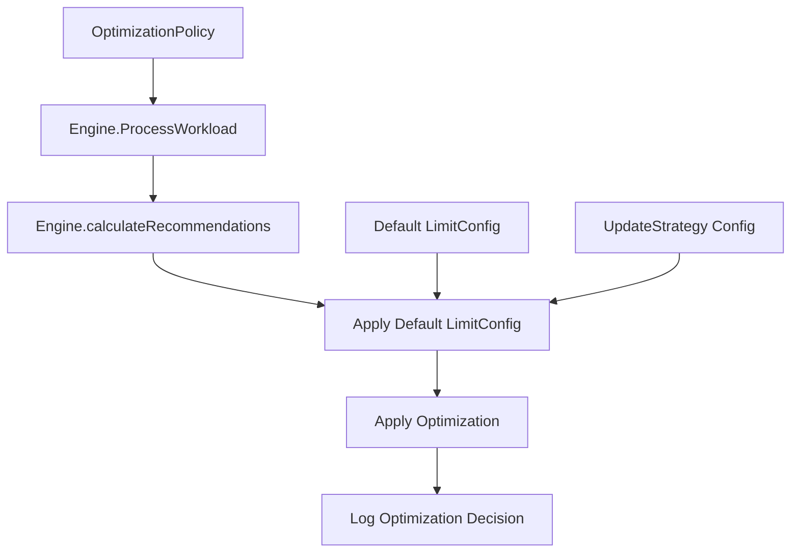

# Memory Safety Enhancements Design

## Overview

This design simplifies the OptipPod memory safety mechanism by removing the overly conservative `isUnsafeMemoryDecrease` function that blocks legitimate optimizations. Since OptipPod already analyzes past usage patterns to make informed decisions, we can trust the recommendations and apply them with appropriate limit configurations.

The new approach:

1. **Remove Safety Checks**: Eliminate the `isUnsafeMemoryDecrease` function entirely
2. **Default Limit Configuration**: Apply a sensible default limit multiplier when none is specified
3. **Trust Usage-Based Recommendations**: Let the metrics-driven recommendations guide optimization decisions

## Architecture

The memory safety enhancements will be implemented by simplifying the optimization engine in `engine.go`. The changes remove the conservative safety checks while ensuring sensible limit configurations are applied.

### Component Interaction



## Components and Interfaces

### 1. Simplified UpdateStrategy API

The `UpdateStrategy` struct will be simplified, removing complex safety override options:

```go
type UpdateStrategy struct {
    // Existing fields...
    AllowInPlaceResize bool `json:"allowInPlaceResize,omitempty"`
    AllowRecreate      bool `json:"allowRecreate,omitempty"`
    UpdateRequestsOnly bool `json:"updateRequestsOnly,omitempty"`
    
    // Simplified approach - just use default limit config
    UseServerSideApply bool `json:"useServerSideApply,omitempty"`
}
```

### 2. Default Limit Configuration

A default limit configuration will be applied when none is specified:

```go
const (
    DefaultMemoryLimitMultiplier = 1.3  // 30% buffer above requests
    DefaultCPULimitMultiplier    = 1.5  // 50% buffer above requests
)

type DefaultLimitConfig struct {
    MemoryMultiplier float64
    CPUMultiplier    float64
}
```

### 3. Simplified Engine Methods

The engine will have simplified methods without safety checks:

```go
func (e *Engine) applyOptimization(
    workload *Workload,
    recommendations *ResourceRecommendations,
    policy *v1alpha1.OptimizationPolicy,
) error

func (e *Engine) calculateLimitsWithDefaults(
    requests corev1.ResourceList,
    limitConfig *LimitConfig,
) corev1.ResourceList
```

## Data Models

### Simplified Resource Calculation

The resource calculation will be streamlined:

```go
type ResourceCalculation struct {
    Requests corev1.ResourceList
    Limits   corev1.ResourceList
    Applied  bool
    Reason   string
}

type OptimizationResult struct {
    WorkloadName string
    Before       ResourceCalculation
    After        ResourceCalculation
    Success      bool
    Message      string
}
```

## Correctness Properties

*A property is a characteristic or behavior that should hold true across all valid executions of a system-essentially, a formal statement about what the system should do. Properties serve as the bridge between human-readable specifications and machine-verifiable correctness guarantees.*

### Simplified Properties

With the removal of safety checks, the properties focus on correct application of recommendations and limit configurations:

**Property 1: Default Limit Application**
*For any* workload optimization where no limit configuration is specified, default multipliers should be applied to calculate limits from requests
**Validates: Requirements - Default limit behavior**

**Property 2: Recommendation Application**
*For any* workload with valid metrics data, the calculated recommendations should be applied without safety check interference
**Validates: Requirements - Remove blocking safety checks**

**Property 3: UpdateRequestsOnly Behavior**
*For any* workload where updateRequestsOnly=true, only request values should be modified, leaving limits unchanged
**Validates: Requirements - Respect update strategy settings**

**Property 4: Limit Configuration Precedence**
*For any* workload with explicit limit configuration, the specified multipliers should take precedence over default values
**Validates: Requirements - Honor explicit configurations**

<function_calls>
<invoke name="prework">
<parameter name="featureName">memory-safety-enhancements

## Error Handling

### Optimization Failures

When optimizations fail, the system will:

1. **Log Clear Reasons**: Include current values, recommendations, and failure reasons
2. **Emit Kubernetes Events**: Create events on the workload explaining optimization failures
3. **Update Policy Status**: Reflect optimization attempts and outcomes in policy status
4. **Continue Processing**: Process other workloads even if one fails

### Resource Calculation Errors

Error scenarios for resource calculations:

1. **Invalid Metrics**: Handle missing or corrupted metrics data gracefully
2. **Calculation Overflow**: Prevent arithmetic errors in multiplier calculations
3. **Resource Parsing**: Handle invalid resource quantity formats
4. **API Validation**: Ensure calculated values meet Kubernetes resource constraints

### Default Configuration Validation

Validate default limit multipliers:

```go
// Validation rules for default multipliers
const (
    MinMultiplier = 1.0   // At least equal to requests
    MaxMultiplier = 10.0  // Reasonable upper bound
)
```

## Testing Strategy

### Dual Testing Approach

The implementation will use both unit tests and property-based tests:

- **Unit tests**: Verify specific examples, edge cases, and error conditions
- **Property tests**: Verify universal properties across all inputs using Go's `testing/quick` package

### Property-Based Testing Configuration

- **Test Framework**: Go's `testing/quick` package for property-based testing
- **Iterations**: Minimum 100 iterations per property test
- **Test Tags**: Each property test will reference its design document property
- **Tag Format**: `// Feature: memory-safety-enhancements, Property {number}: {property_text}`

### Unit Testing Focus Areas

Unit tests will cover:

1. **Specific Examples**: Test cases from requirements document (overutilized/underutilized workloads)
2. **Default Multipliers**: Verify correct application of default limit multipliers
3. **Edge Cases**: Zero values, maximum values, boundary conditions
4. **Error Conditions**: Invalid configurations, missing data, calculation errors
5. **UpdateRequestsOnly**: Verify limits are not modified when flag is set

### Test Data Generation

For property-based tests, we'll generate:

- **Random Workloads**: Various resource configurations and usage patterns
- **Random Policies**: Different update strategies and limit configurations
- **Random Metrics**: Various usage patterns and resource consumption
- **Edge Case Scenarios**: Boundary values and extreme configurations

### Backward Compatibility Testing

Comprehensive tests to ensure:

1. **Existing Behavior**: Current optimizations continue to work
2. **API Compatibility**: No breaking changes to existing APIs
3. **Default Values**: Sensible defaults for new behavior
4. **Migration Safety**: Smooth transition from safety-checked to direct application

## Implementation Notes

### Performance Considerations

1. **Simplified Logic**: Removing safety checks reduces computational overhead
2. **Direct Application**: Faster optimization cycles without safety validation delays
3. **Efficient Calculations**: Simple multiplier-based limit calculations
4. **Reduced Complexity**: Less code paths and decision points

### Observability Enhancements

1. **Structured Logging**: Log optimization decisions with clear reasoning
2. **Metrics**: Add Prometheus metrics for optimization success/failure rates
3. **Events**: Rich Kubernetes events explaining optimization outcomes
4. **Tracing**: Include optimization details in distributed traces

### Security Considerations

1. **RBAC**: No additional permissions required
2. **Validation**: Input validation for multiplier values
3. **Audit Trail**: Complete logging of optimization decisions
4. **Resource Bounds**: Respect policy-defined resource bounds

## Migration Strategy

### Phase 1: Remove Safety Checks
- Remove `isUnsafeMemoryDecrease` function
- Update optimization logic to apply recommendations directly
- Add comprehensive logging for optimization decisions

### Phase 2: Default Limit Configuration
- Implement default multiplier logic
- Add configuration options for default values
- Update documentation and examples

### Phase 3: Testing and Validation
- Comprehensive testing with real workloads
- Monitor optimization outcomes
- Adjust default multipliers based on feedback

### Rollback Plan

If issues arise:
1. **Feature Flags**: Re-enable safety checks via configuration
2. **Logic Rollback**: Restore original safety check function
3. **Monitoring**: Enhanced monitoring during transition period
4. **Gradual Rollout**: Deploy to subset of workloads first