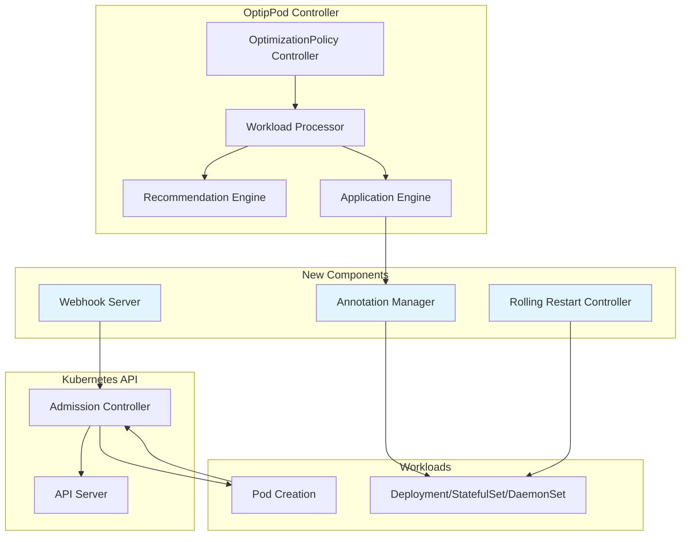

# Design Document: Mutating Webhook Support

## Overview

This design adds mutating webhook support as an alternative to Server Side Apply (SSA) for applying resource recommendations in OptipPod. The feature addresses compatibility issues with ArgoCD and other GitOps tools where SSA is not enabled by default. The mutating webhook intercepts pod creation and modifies resource requests/limits based on annotations, providing seamless resource optimization without requiring SSA capabilities.

## Architecture

The mutating webhook support integrates with the existing OptipPod architecture by:

1. **Strategy Selection**: Adding a new `strategy` field to OptimizationPolicy to choose between "ssa" and "webhook" approaches
2. **Webhook Server**: Implementing a new webhook server component that handles admission requests
3. **Annotation Management**: Extending the existing annotation system to store resource recommendations
4. **Rolling Restart Control**: Adding configuration to control when resource changes take effect

### High-Level Architecture Diagram



## Components and Interfaces

### 1. Strategy Configuration

**Location**: `api/v1alpha1/optimizationpolicy_types.go`

Add new fields to `UpdateStrategy`:

```go
type UpdateStrategy struct {
    // Existing fields...
    
    // Strategy defines how resource updates are applied
    // +kubebuilder:validation:Enum=ssa;webhook
    // +kubebuilder:default="webhook"
    // +optional
    Strategy *string `json:"strategy,omitempty"`
    
    // RolloutStrategy defines when resource changes take effect (webhook strategy only)
    // +kubebuilder:validation:Enum=immediate;onNextRestart
    // +kubebuilder:default="onNextRestart"
    // +optional
    RolloutStrategy *string `json:"rolloutStrategy,omitempty"`
}
```

### 2. Webhook Server Component

**Location**: `internal/webhook/server.go`

```go
type Server struct {
    client     client.Client
    server     *http.Server
    certPath   string
    keyPath    string
    port       int
}

type AdmissionRequest struct {
    Pod    *corev1.Pod
    DryRun bool
}

type AdmissionResponse struct {
    Allowed bool
    Patches []PatchOperation
    Message string
}
```

**Key Methods**:
- `NewServer(client, certPath, keyPath, port) *Server`
- `Start(ctx) error`
- `Stop(ctx) error`
- `HandleAdmission(w http.ResponseWriter, r *http.Request)`
- `MutatePod(req *AdmissionRequest) *AdmissionResponse`

### 3. Annotation Manager

**Location**: `internal/webhook/annotations.go`

```go
type AnnotationManager struct {
    client client.Client
}

type ResourceRecommendation struct {
    ContainerName string
    CPU           resource.Quantity
    Memory        resource.Quantity
    CPULimit      *resource.Quantity
    MemoryLimit   *resource.Quantity
}
```

**Annotation Keys**:
```go
const (
    // Webhook-specific annotations
    AnnotationWebhookEnabled = "optipod.io/webhook-enabled"
    AnnotationStrategy       = "optipod.io/strategy"
    
    // Resource recommendation annotations (per container)
    AnnotationCPURequest    = "optipod.io/cpu-request.%s"    // %s = container name
    AnnotationMemoryRequest = "optipod.io/memory-request.%s"
    AnnotationCPULimit      = "optipod.io/cpu-limit.%s"
    AnnotationMemoryLimit   = "optipod.io/memory-limit.%s"
)
```

**Key Methods**:
- `StoreRecommendations(workload, recommendations) error`
- `GetRecommendations(pod) ([]ResourceRecommendation, error)`
- `ClearRecommendations(workload) error`

### 4. Rolling Restart Controller

**Location**: `internal/webhook/rollout.go`

```go
type RolloutController struct {
    client client.Client
}
```

**Key Methods**:
- `TriggerRollingRestart(workload, policy) error`
- `SupportsRollingRestart(workloadKind) bool`
- `UpdatePodTemplate(workload) error`

### 5. Enhanced Application Engine

**Location**: `internal/application/engine.go`

Add new method to support webhook strategy:

```go
// ApplyWithWebhook applies resource recommendations using webhook strategy
func (e *Engine) ApplyWithWebhook(
    ctx context.Context,
    workload *Workload,
    containerName string,
    rec *recommendation.Recommendation,
    policy *optipodv1alpha1.OptimizationPolicy,
) (*ApplyResult, error)
```

### 6. Certificate Management System

**Location**: `internal/webhook/certificates.go`

```go
type CertificateManager struct {
    client     client.Client
    namespace  string
    certPath   string
    keyPath    string
    caPath     string
}

type CertificateConfig struct {
    ServiceName      string
    Namespace        string
    DNSNames         []string
    ValidityDuration time.Duration
}
```

**Key Methods**:
- `NewCertificateManager(client, namespace, certPath, keyPath) *CertificateManager`
- `EnsureCertificates(ctx, config) error`
- `ValidateCertificates() error`
- `GetCABundle() ([]byte, error)`
- `CheckExpiration() (time.Duration, error)`

**Design Rationale**: The certificate management system provides a unified interface for both cert-manager and manual certificate provisioning. This design choice ensures consistent certificate handling regardless of the deployment method while maintaining flexibility for different cluster configurations.

### 7. Webhook Lifecycle Manager

**Location**: `internal/webhook/lifecycle.go`

```go
type LifecycleManager struct {
    client          client.Client
    webhookName     string
    serviceName     string
    namespace       string
    certManager     *CertificateManager
    validationTests []ValidationTest
}

type ValidationTest struct {
    Name        string
    TestFunc    func(context.Context) error
    Description string
}
```

**Key Methods**:
- `NewLifecycleManager(client, webhookName, serviceName, namespace) *LifecycleManager`
- `RegisterWebhook(ctx, caBundle) error`
- `UnregisterWebhook(ctx) error`
- `ValidateStartup(ctx) error`
- `PerformSelfTest(ctx) error`

**Design Rationale**: The lifecycle manager centralizes webhook registration, validation, and cleanup operations. This separation of concerns makes the webhook server more focused on request handling while ensuring proper integration with Kubernetes admission control.

## Data Models

### Webhook Configuration

```yaml
apiVersion: optipod.optipod.io/v1alpha1
kind: OptimizationPolicy
metadata:
  name: webhook-policy
spec:
  mode: Auto
  updateStrategy:
    strategy: webhook                    # New field
    rolloutStrategy: onNextRestart      # New field
    useServerSideApply: false           # Ignored when strategy=webhook
  # ... other fields
```

### Pod Annotations (Applied by Controller)

```yaml
apiVersion: v1
kind: Pod
metadata:
  annotations:
    optipod.io/webhook-enabled: "true"
    optipod.io/strategy: "webhook"
    optipod.io/cpu-request.app: "100m"
    optipod.io/memory-request.app: "128Mi"
    optipod.io/cpu-limit.app: "200m"
    optipod.io/memory-limit.app: "256Mi"
```

### Mutating Webhook Configuration

```yaml
apiVersion: admissionregistration.k8s.io/v1
kind: MutatingAdmissionWebhook
metadata:
  name: optipod-webhook
  annotations:
    cert-manager.io/inject-ca-from: optipod-system/optipod-webhook-cert  # Auto CA injection
webhooks:
- name: pod-resource-mutator.optipod.io
  clientConfig:
    service:
      name: optipod-webhook-service
      namespace: optipod-system
      path: /mutate
  rules:
  - operations: ["CREATE"]
    apiGroups: [""]
    apiVersions: ["v1"]
    resources: ["pods"]
  namespaceSelector:
    matchExpressions:
    - key: name
      operator: NotIn
      values: ["kube-system", "kube-public", "optipod-system"]
  admissionReviewVersions: ["v1", "v1beta1"]
  sideEffects: None
  failurePolicy: Fail
  timeoutSeconds: 10
```

### Certificate Resources (cert-manager)

```yaml
apiVersion: cert-manager.io/v1
kind: Issuer
metadata:
  name: optipod-webhook-issuer
  namespace: optipod-system
spec:
  selfSigned: {}
---
apiVersion: cert-manager.io/v1
kind: Certificate
metadata:
  name: optipod-webhook-cert
  namespace: optipod-system
spec:
  secretName: optipod-webhook-certs
  issuerRef:
    name: optipod-webhook-issuer
    kind: Issuer
  dnsNames:
  - optipod-webhook-service
  - optipod-webhook-service.optipod-system
  - optipod-webhook-service.optipod-system.svc
  - optipod-webhook-service.optipod-system.svc.cluster.local
  duration: 8760h  # 1 year
  renewBefore: 720h  # 30 days
```

### Installation Script Configuration

The installation script supports both cert-manager and manual certificate modes:

```bash
#!/bin/bash
# Enhanced installation script with certificate management

detect_cert_manager() {
    kubectl get crd certificates.cert-manager.io >/dev/null 2>&1
}

generate_manual_certificates() {
    local service_name="optipod-webhook-service"
    local namespace="optipod-system"
    
    # Generate CA private key
    openssl genrsa -out ca.key 2048
    
    # Generate CA certificate
    openssl req -new -x509 -key ca.key -out ca.crt -days 365 \
        -subj "/CN=OptipPod Webhook CA"
    
    # Generate server private key
    openssl genrsa -out server.key 2048
    
    # Create certificate signing request
    cat > server.conf <<EOF
[req]
distinguished_name = req_distinguished_name
req_extensions = v3_req
[req_distinguished_name]
[v3_req]
basicConstraints = CA:FALSE
keyUsage = nonRepudiation, digitalSignature, keyEncipherment
subjectAltName = @alt_names
[alt_names]
DNS.1 = ${service_name}
DNS.2 = ${service_name}.${namespace}
DNS.3 = ${service_name}.${namespace}.svc
DNS.4 = ${service_name}.${namespace}.svc.cluster.local
EOF
    
    # Generate server certificate
    openssl req -new -key server.key -out server.csr -config server.conf \
        -subj "/CN=${service_name}.${namespace}.svc"
    openssl x509 -req -in server.csr -CA ca.crt -CAkey ca.key -CAcreateserial \
        -out server.crt -days 365 -extensions v3_req -extfile server.conf
}

inject_ca_bundle() {
    local ca_bundle=$(base64 -w 0 < ca.crt)
    kubectl patch mutatingwebhookconfiguration optipod-webhook \
        --type='json' \
        -p="[{'op': 'replace', 'path': '/webhooks/0/clientConfig/caBundle', 'value': '${ca_bundle}'}]"
}
```

## Correctness Properties

*A property is a characteristic or behavior that should hold true across all valid executions of a system-essentially, a formal statement about what the system should do. Properties serve as the bridge between human-readable specifications and machine-verifiable correctness guarantees.*

### Property Reflection

After completing the initial prework analysis, I performed a property reflection to eliminate redundancy:

**Redundancy Analysis:**
- Properties 1.1 and 1.4 both test default strategy behavior - combined into Property 1
- Properties 1.2 and 1.3 test strategy routing - combined into Property 1
- Properties 4.1, 4.2, and 4.3 test rollout strategy behavior - combined into Property 9
- Properties 5.1, 5.2, 5.3, 5.4, and 5.5 test SSA compatibility - combined into Property 11
- Properties 7.1 and 7.2 test logging behavior - combined into Property 14
- Properties 8.1, 8.2, 8.4, 8.5, 8.6, 9.1, 9.2, 9.3, 9.4, 9.5, 9.6, 10.1, 10.2 are examples rather than properties
- Several certificate and installation properties can be combined

**Final Properties (after consolidation):**

Property 1: Strategy configuration and routing
*For any* OptimizationPolicy, when strategy is set to "ssa" the system should use SSA methods, when set to "webhook" should use webhook methods, and when omitted should default to "webhook"
**Validates: Requirements 1.1, 1.2, 1.3, 1.4**

Property 2: Strategy validation
*For any* OptimizationPolicy, when strategy field contains invalid values, the system should reject the policy with validation errors
**Validates: Requirements 1.5**

Property 3: Webhook pod modification behavior
*For any* pod creation request, when the pod has optimization annotations and matches policy selectors, the webhook should modify resource requests and limits according to the annotations
**Validates: Requirements 2.1, 2.4**

Property 4: Webhook non-interference
*For any* pod creation request, when the pod lacks optimization annotations or doesn't match policy selectors, the webhook should leave the pod unchanged
**Validates: Requirements 2.2, 2.5**

Property 5: Webhook strategy control
*For any* pod creation request, when webhook strategy is disabled, the webhook should not modify any pods regardless of annotations
**Validates: Requirements 2.3**

Property 6: Annotation storage and format
*For any* resource recommendation, when stored as annotations, the system should use standardized annotation keys and the webhook should correctly parse and apply the values
**Validates: Requirements 3.1, 3.2, 3.3**

Property 7: Annotation error handling
*For any* pod with invalid annotation values, the webhook should log errors and leave resources unchanged, allowing pod creation to proceed
**Validates: Requirements 3.4, 7.4**

Property 8: Annotation scope handling
*For any* pod with both container-specific and pod-level annotations, the system should handle both types correctly with container-specific taking precedence
**Validates: Requirements 3.5**

Property 9: Rollout strategy behavior
*For any* workload with webhook strategy, when rolloutStrategy is "immediate" the system should trigger rolling restart, when "onNextRestart" should only apply annotations, and when omitted should default to "onNextRestart"
**Validates: Requirements 4.1, 4.2, 4.3**

Property 10: Rolling restart workload validation
*For any* workload type, the system should only perform rolling restarts on supported workload types (Deployments, StatefulSets, DaemonSets) and update pod templates to trigger restarts
**Validates: Requirements 4.4, 4.5**

Property 11: SSA compatibility preservation
*For any* OptimizationPolicy using SSA strategy, the system should use existing SSA implementation, maintain all existing functionality, ignore webhook-specific options, and support mixed environments
**Validates: Requirements 5.1, 5.2, 5.3, 5.4, 5.5**

Property 12: Webhook lifecycle management
*For any* controller startup and shutdown, the system should register webhook configuration on startup with appropriate failure policies and selectors, and clean up registrations on shutdown
**Validates: Requirements 6.1, 6.2, 6.3**

Property 13: Certificate management and validation
*For any* certificate operation, the system should handle certificate management, rotation, and validation correctly, providing warnings for certificates expiring within 30 days
**Validates: Requirements 6.4, 8.3, 8.7**

Property 14: Webhook health monitoring
*For any* webhook endpoint, the system should provide health checks and readiness probes that respond correctly
**Validates: Requirements 6.5**

Property 15: Webhook observability
*For any* webhook operation, the system should log successful modifications and detailed error information, and emit metrics for admission requests, successes, and failures
**Validates: Requirements 7.1, 7.2, 7.3**

Property 16: Webhook debugging support
*For any* webhook configuration and operation, the system should provide debugging information through logs or endpoints
**Validates: Requirements 7.5**

Property 17: Webhook configuration validation
*For any* webhook configuration, all references should resolve correctly and the configuration should be valid
**Validates: Requirements 9.7**

Property 18: Certificate generation quality
*For any* manually generated certificates, they should have proper DNS names and extensions required for webhook operation
**Validates: Requirements 10.3**

Property 19: Installation CA bundle handling
*For any* installation process, the CA bundle should be correctly extracted from certificates and injected into the webhook configuration
**Validates: Requirements 10.4, 10.5**

Property 20: Installation validation and error handling
*For any* installation process, all required resources should be validated as created and ready, with clear error messages on failure
**Validates: Requirements 10.6, 10.7**

Property 21: Startup validation and fail-fast behavior
*For any* webhook server startup, the system should validate certificates, service reachability, webhook configuration, and perform self-tests, failing fast with diagnostic information on any validation failure
**Validates: Requirements 11.1, 11.2, 11.3, 11.4, 11.5, 11.6, 11.7**

## Error Handling

### Webhook Error Scenarios

1. **Certificate Issues**
   - Invalid or expired certificates → Fail startup with detailed diagnostics
   - Certificate rotation failures → Log errors and attempt recovery
   - Missing CA bundle → Fail webhook registration with clear error message

2. **Annotation Parsing Errors**
   - Invalid resource quantity formats → Log error and skip modification
   - Missing required annotations → Allow pod creation unchanged
   - Malformed annotation keys → Log warning and ignore malformed annotations

3. **Policy Matching Errors**
   - Multiple policies matching same pod → Use highest weight policy
   - Policy selector evaluation failures → Skip modification and log error
   - No matching policies → Allow pod creation unchanged

4. **Resource Validation Errors**
   - Resource values outside policy bounds → Skip modification and log warning
   - Invalid resource combinations → Log error and preserve existing resources
   - Container not found → Log warning and skip container-specific modifications

5. **Webhook Unavailability**
   - Webhook server down or unreachable → Configured failure policy determines behavior
   - Network connectivity issues → Kubernetes retries based on timeout configuration
   - TLS handshake failures → Log certificate issues and fail admission

### Certificate Management Error Handling

1. **cert-manager Integration Errors**
   - cert-manager not available → Fall back to manual certificate mode
   - Certificate resource creation failures → Log detailed error and exit
   - CA bundle injection failures → Retry with exponential backoff

2. **Manual Certificate Errors**
   - Certificate generation failures → Provide clear error message and cleanup instructions
   - Invalid certificate properties → Validate and report specific issues
   - CA bundle extraction failures → Log detailed error with troubleshooting steps

### Installation Error Handling

1. **Environment Detection Errors**
   - Unable to detect cert-manager → Default to manual mode with warning
   - Kubernetes API unreachable → Fail with connectivity troubleshooting steps
   - Insufficient permissions → Report specific RBAC requirements

2. **Resource Creation Errors**
   - Webhook configuration creation failures → Provide rollback instructions
   - Service or deployment creation failures → Validate cluster resources and permissions
   - Certificate secret creation failures → Check namespace permissions and storage

**Design Rationale**: The error handling strategy prioritizes fail-fast behavior during startup while being permissive during runtime operations. This ensures configuration issues are caught early while preventing webhook failures from blocking legitimate pod creation.

## Testing Strategy

### Unit Testing Approach

**Core Components Testing**:
- Webhook server request/response handling
- Annotation parsing and validation logic
- Policy strategy routing decisions
- Rolling restart trigger mechanisms
- Certificate management operations

**Error Condition Testing**:
- Invalid annotation formats and values
- Network failures and timeouts
- Certificate expiration scenarios
- Policy selector edge cases
- Resource validation boundary conditions

### Property-Based Testing Configuration

**Testing Framework**: Use Go's `testing/quick` package or `github.com/leanovate/gopter` for property-based testing

**Test Configuration**:
- Minimum 100 iterations per property test
- Each property test references its design document property
- Tag format: **Feature: mutating-webhook-support, Property {number}: {property_text}**

**Key Property Test Areas**:

1. **Strategy Configuration Properties** (Properties 1-2)
   - Generate random OptimizationPolicy configurations
   - Test strategy field validation and routing behavior
   - Verify default values are applied correctly

2. **Webhook Behavior Properties** (Properties 3-5)
   - Generate random pod specifications with/without annotations
   - Test webhook modification behavior across different scenarios
   - Verify selective modification based on policy matching

3. **Annotation Handling Properties** (Properties 6-8)
   - Generate random resource recommendations and annotation formats
   - Test annotation storage, parsing, and error handling
   - Verify container-specific vs pod-level annotation precedence

4. **Rollout Strategy Properties** (Properties 9-10)
   - Generate random workload types and rollout configurations
   - Test rolling restart behavior and workload type validation
   - Verify pod template update mechanisms

5. **Compatibility Properties** (Property 11)
   - Generate mixed SSA/webhook policy configurations
   - Test backward compatibility and strategy isolation
   - Verify existing SSA functionality preservation

6. **Lifecycle and Certificate Properties** (Properties 12-14)
   - Generate different certificate states and configurations
   - Test webhook registration, health checks, and certificate management
   - Verify startup validation and fail-fast behavior

7. **Installation and Configuration Properties** (Properties 17-21)
   - Generate different installation scenarios and certificate configurations
   - Test certificate generation, CA bundle handling, and validation
   - Verify error handling and diagnostic information quality

**Property Test Examples**:

```go
// Property 1: Strategy configuration and routing
func TestStrategyConfigurationProperty(t *testing.T) {
    property := func(strategyValue *string) bool {
        policy := generateRandomPolicy()
        policy.Spec.UpdateStrategy.Strategy = strategyValue
        
        // Test routing behavior based on strategy
        if strategyValue == nil || *strategyValue == "webhook" {
            return usesWebhookStrategy(policy)
        } else if *strategyValue == "ssa" {
            return usesSSAStrategy(policy)
        }
        return true // Invalid values should be caught by validation
    }
    
    if err := quick.Check(property, &quick.Config{MaxCount: 100}); err != nil {
        t.Errorf("Property failed: %v", err)
    }
}

// Property 21: Startup validation and fail-fast behavior
func TestStartupValidationProperty(t *testing.T) {
    property := func(certValid bool, serviceReachable bool, configValid bool) bool {
        server := setupTestWebhookServer(certValid, serviceReachable, configValid)
        
        err := server.ValidateStartup(context.Background())
        
        if certValid && serviceReachable && configValid {
            return err == nil // Should succeed
        } else {
            return err != nil && server.ExitCode() != 0 // Should fail fast
        }
    }
    
    if err := quick.Check(property, &quick.Config{MaxCount: 100}); err != nil {
        t.Errorf("Property failed: %v", err)
    }
}
```

### Integration Testing

**Webhook Integration Tests**:
- End-to-end pod creation with webhook modification
- Certificate rotation and renewal testing
- Failure policy behavior verification
- Performance testing under load

**Certificate Management Tests**:
- cert-manager integration testing
- Manual certificate generation and installation
- CA bundle injection and validation
- Certificate expiration monitoring

**Installation Script Tests**:
- cert-manager detection and integration
- Manual certificate mode testing
- Error handling and cleanup verification
- Multi-environment deployment testing

**SSA Compatibility Tests**:
- Mixed environment testing with both strategies
- Migration testing from SSA to webhook
- Backward compatibility verification
- Resource ownership conflict resolution

**Rolling Restart Tests**:
- Immediate vs onNextRestart behavior verification
- Workload type support validation
- Pod template update verification
- Restart trigger mechanism testing

**Startup Validation Tests**:
- Certificate validation during startup
- Service reachability testing
- Webhook configuration validation
- Self-test execution and failure handling

### Test Coverage Requirements

**Minimum Coverage Targets**:
- Unit tests: 85% code coverage
- Property tests: All 21 properties implemented
- Integration tests: All major user workflows
- Error scenarios: All identified error conditions

**Test Execution**:
- Unit tests run on every commit
- Property tests run on pull requests (100+ iterations each)
- Integration tests run on release candidates
- Performance tests run weekly on main branch
- Certificate rotation tests run monthly
