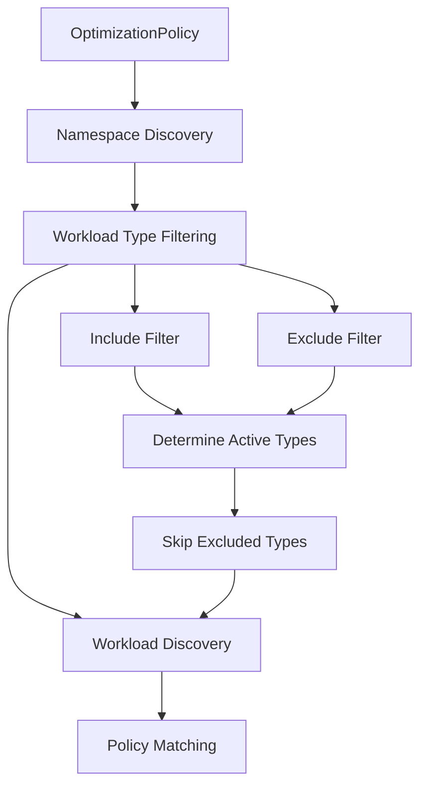

# Design Document

## Overview

This design extends OptimizationPolicy's workload selection capabilities by adding workload type filtering. Users will be able to specify which Kubernetes workload types (Deployment, StatefulSet, DaemonSet) should be included or excluded from optimization policies. This enables gradual adoption patterns, risk management, and workload-type-specific optimization strategies.

The enhancement integrates seamlessly with existing selector mechanisms (namespace selectors, workload label selectors, namespace allow/deny lists) while maintaining full backward compatibility.

## Architecture

### Current Architecture

OptimizationPolicy currently uses a three-stage workload selection process:

1. **Namespace Discovery**: Find namespaces matching namespace selectors and allow/deny lists
2. **Workload Discovery**: For each matching namespace, discover all workload types (Deployment, StatefulSet, DaemonSet) that match workload label selectors
3. **Policy Matching**: When processing individual workloads, verify they match the policy selectors

### Enhanced Architecture

The enhanced architecture adds workload type filtering at the discovery stage:



### Integration Points

1. **API Types**: Extend `WorkloadSelector` with `WorkloadTypes` field
2. **Discovery Engine**: Modify discovery logic to respect workload type filters
3. **Policy Matcher**: Add workload type validation during policy matching
4. **Status Reporting**: Enhance status to show workload type breakdown

## Components and Interfaces

### API Types Enhancement

```go
// WorkloadSelector defines which workloads a policy applies to
type WorkloadSelector struct {
    // Existing fields
    NamespaceSelector *metav1.LabelSelector `json:"namespaceSelector,omitempty"`
    WorkloadSelector  *metav1.LabelSelector `json:"workloadSelector,omitempty"`
    Namespaces        *NamespaceFilter      `json:"namespaces,omitempty"`
    
    // New field for workload type filtering
    WorkloadTypes     *WorkloadTypeFilter   `json:"workloadTypes,omitempty"`
}

// WorkloadTypeFilter defines include/exclude filters for workload types
type WorkloadTypeFilter struct {
    // Include specifies workload types to include (if empty, includes all)
    Include []WorkloadType `json:"include,omitempty"`
    
    // Exclude specifies workload types to exclude (takes precedence over Include)
    Exclude []WorkloadType `json:"exclude,omitempty"`
}

// WorkloadType represents supported Kubernetes workload types
// +kubebuilder:validation:Enum=Deployment;StatefulSet;DaemonSet
type WorkloadType string

const (
    WorkloadTypeDeployment  WorkloadType = "Deployment"
    WorkloadTypeStatefulSet WorkloadType = "StatefulSet"
    WorkloadTypeDaemonSet   WorkloadType = "DaemonSet"
)
```

### Discovery Engine Enhancement

The discovery engine will be enhanced with workload type filtering logic:

```go
// Enhanced DiscoverWorkloads function
func DiscoverWorkloads(ctx context.Context, c client.Client, policy *optipodv1alpha1.OptimizationPolicy) ([]Workload, error) {
    // Get effective workload types based on include/exclude filters
    activeTypes := getActiveWorkloadTypes(policy.Spec.Selector.WorkloadTypes)
    
    // Get matching namespaces (unchanged)
    namespaces, err := getMatchingNamespaces(ctx, c, policy)
    if err != nil {
        return nil, err
    }
    
    var allWorkloads []Workload
    
    // Discover workloads only for active types
    for _, ns := range namespaces {
        if activeTypes.Contains(WorkloadTypeDeployment) {
            deployments, err := discoverDeployments(ctx, c, ns, policy)
            if err != nil {
                return nil, err
            }
            allWorkloads = append(allWorkloads, deployments...)
        }
        
        if activeTypes.Contains(WorkloadTypeStatefulSet) {
            statefulSets, err := discoverStatefulSets(ctx, c, ns, policy)
            if err != nil {
                return nil, err
            }
            allWorkloads = append(allWorkloads, statefulSets...)
        }
        
        if activeTypes.Contains(WorkloadTypeDaemonSet) {
            daemonSets, err := discoverDaemonSets(ctx, c, ns, policy)
            if err != nil {
                return nil, err
            }
            allWorkloads = append(allWorkloads, daemonSets...)
        }
    }
    
    return allWorkloads, nil
}

// Helper function to determine active workload types
func getActiveWorkloadTypes(filter *WorkloadTypeFilter) WorkloadTypeSet {
    allTypes := NewWorkloadTypeSet(WorkloadTypeDeployment, WorkloadTypeStatefulSet, WorkloadTypeDaemonSet)
    
    if filter == nil {
        return allTypes // No filter = all types active
    }
    
    var activeTypes WorkloadTypeSet
    
    // Start with include list (or all types if include is empty)
    if len(filter.Include) > 0 {
        activeTypes = NewWorkloadTypeSet(filter.Include...)
    } else {
        activeTypes = allTypes
    }
    
    // Apply exclude list (takes precedence)
    for _, excludeType := range filter.Exclude {
        activeTypes.Remove(excludeType)
    }
    
    return activeTypes
}
```

### Policy Matcher Enhancement

The policy matcher will add workload type validation:

```go
// Enhanced policyMatchesWorkload function
func (ps *PolicySelector) policyMatchesWorkload(ctx context.Context, policy *optipodv1alpha1.OptimizationPolicy, workload *discovery.Workload) bool {
    // Check workload type filter first (new)
    if !workloadTypeMatches(policy.Spec.Selector.WorkloadTypes, workload.Kind) {
        return false
    }
    
    // Existing namespace and label selector logic...
    // (unchanged)
    
    return true
}

// Helper function for workload type matching
func workloadTypeMatches(filter *WorkloadTypeFilter, workloadKind string) bool {
    if filter == nil {
        return true // No filter = all types match
    }
    
    workloadType := WorkloadType(workloadKind)
    activeTypes := getActiveWorkloadTypes(filter)
    return activeTypes.Contains(workloadType)
}
```

### Status Enhancement

The OptimizationPolicy status will be enhanced to show workload type breakdown:

```go
// Enhanced OptimizationPolicyStatus
type OptimizationPolicyStatus struct {
    // Existing fields
    Conditions          []metav1.Condition `json:"conditions,omitempty"`
    WorkloadsDiscovered int                `json:"workloadsDiscovered,omitempty"`
    WorkloadsProcessed  int                `json:"workloadsProcessed,omitempty"`
    LastReconciliation  *metav1.Time       `json:"lastReconciliation,omitempty"`
    
    // New field for workload type breakdown
    WorkloadsByType     *WorkloadTypeStatus `json:"workloadsByType,omitempty"`
}

// WorkloadTypeStatus provides breakdown by workload type
type WorkloadTypeStatus struct {
    Deployments  int `json:"deployments,omitempty"`
    StatefulSets int `json:"statefulSets,omitempty"`
    DaemonSets   int `json:"daemonSets,omitempty"`
}
```

## Data Models

### Configuration Examples

**Include Only Deployments:**
```yaml
apiVersion: optipod.optipod.io/v1alpha1
kind: OptimizationPolicy
spec:
  selector:
    workloadTypes:
      include: ["Deployment"]
    namespaceSelector:
      matchLabels:
        environment: production
```

**Exclude StatefulSets:**
```yaml
apiVersion: optipod.optipod.io/v1alpha1
kind: OptimizationPolicy
spec:
  selector:
    workloadTypes:
      exclude: ["StatefulSet"]
    workloadSelector:
      matchLabels:
        optimize: "true"
```

**Complex Filtering (Exclude takes precedence):**
```yaml
apiVersion: optipod.optipod.io/v1alpha1
kind: OptimizationPolicy
spec:
  selector:
    workloadTypes:
      include: ["Deployment", "StatefulSet"]
      exclude: ["StatefulSet"]  # Only Deployments will be processed
```

### Validation Rules

1. **Valid Workload Types**: Only "Deployment", "StatefulSet", "DaemonSet" are allowed
2. **Precedence**: Exclude list takes precedence over include list
3. **Empty Result**: If filtering results in no active workload types, policy remains valid but discovers no workloads
4. **Backward Compatibility**: Missing `workloadTypes` field defaults to all types

## Correctness Properties

*A property is a characteristic or behavior that should hold true across all valid executions of a system-essentially, a formal statement about what the system should do. Properties serve as the bridge between human-readable specifications and machine-verifiable correctness guarantees.*

After analyzing the acceptance criteria, I identified the following core properties that eliminate redundancy while providing comprehensive coverage:

**Property 1: Include Filter Behavior**
*For any* OptimizationPolicy with workloadTypes.include specified, the Discovery_Engine should only discover workloads whose types are in the include list
**Validates: Requirements 1.1, 1.2, 1.3**

**Property 2: Backward Compatibility for Missing Filters**
*For any* OptimizationPolicy without workloadTypes specified, the Discovery_Engine should discover all supported workload types (Deployment, StatefulSet, DaemonSet)
**Validates: Requirements 1.4, 5.1**

**Property 3: Policy Matcher Include Validation**
*For any* workload and OptimizationPolicy with workloadTypes.include, the Policy_Matcher should only match if the workload type is in the include list
**Validates: Requirements 1.5**

**Property 4: Exclude Filter Behavior**
*For any* OptimizationPolicy with workloadTypes.exclude specified, the Discovery_Engine should not discover workloads whose types are in the exclude list
**Validates: Requirements 2.1, 2.2, 2.3**

**Property 5: Policy Matcher Exclude Validation**
*For any* workload and OptimizationPolicy with workloadTypes.exclude, the Policy_Matcher should not match if the workload type is in the exclude list
**Validates: Requirements 2.5**

**Property 6: Exclude Precedence Over Include**
*For any* OptimizationPolicy with both workloadTypes.include and workloadTypes.exclude, workload types in the exclude list should not be discovered even if they appear in the include list
**Validates: Requirements 3.1, 3.2**

**Property 7: Empty Result Set Handling**
*For any* OptimizationPolicy where workloadTypes filtering results in no valid workload types, the Discovery_Engine should return an empty result set
**Validates: Requirements 3.3**

**Property 8: Workload Type Validation**
*For any* OptimizationPolicy with invalid workload type names in workloadTypes.include or workloadTypes.exclude, the validation should reject the policy with a descriptive error
**Validates: Requirements 4.1, 4.2, 4.3**

**Property 9: Empty Filter Configuration Validity**
*For any* OptimizationPolicy where workloadTypes configuration results in no discoverable workload types, the policy should remain valid for creation
**Validates: Requirements 4.4**

**Property 10: Optional Field Validation**
*For any* OptimizationPolicy without workloadTypes field, the validation should succeed (field is optional)
**Validates: Requirements 5.3**

**Property 11: Status Workload Type Reporting**
*For any* OptimizationPolicy with workloadTypes filtering, the status should accurately report counts by workload type matching the actual discovered workloads
**Validates: Requirements 6.1, 6.2**

**Property 12: Status Backward Compatibility**
*For any* OptimizationPolicy, the status should maintain existing fields (workloadsDiscovered, workloadsProcessed) with correct values
**Validates: Requirements 6.4**

**Property 13: Multiple Policy Independence**
*For any* set of OptimizationPolicies with different workloadTypes filters, each policy's workload type constraints should be evaluated independently
**Validates: Requirements 7.1**

**Property 14: Weight-Based Selection with Type Filtering**
*For any* workload matching multiple OptimizationPolicies with compatible workload type filters, the Policy_Matcher should select the highest weight policy
**Validates: Requirements 7.2, 7.3**

<function_calls>
<invoke name="prework">
<parameter name="featureName">workload-type-selector

## Error Handling

### Validation Errors

**Invalid Workload Types:**
- Error: `"invalid workload type 'Job' in workloadTypes.include, must be one of: Deployment, StatefulSet, DaemonSet"`
- Error: `"invalid workload type 'CronJob' in workloadTypes.exclude, must be one of: Deployment, StatefulSet, DaemonSet"`

**Empty Result Set:**
- Warning: `"workloadTypes configuration results in no discoverable workload types"`
- Behavior: Policy remains valid but discovers no workloads

### Runtime Errors

**Discovery Failures:**
- If discovery of a specific workload type fails, log error and continue with other types
- Partial failures should not prevent discovery of other workload types
- Status should reflect actual discovered counts, not intended counts

**Policy Matching Errors:**
- If workload type validation fails during policy matching, skip that policy
- Log warning about policy matching failure
- Continue evaluating other policies

### Backward Compatibility

**Missing Field Handling:**
- Treat missing `workloadTypes` field as "include all types"
- Ensure existing policies continue working without modification
- Maintain identical discovery behavior for policies without the new field

## Testing Strategy

### Unit Testing Approach

**Core Logic Testing:**
- Test `getActiveWorkloadTypes()` function with various include/exclude combinations
- Test workload type validation logic with valid and invalid inputs
- Test precedence rules (exclude takes precedence over include)
- Test backward compatibility with nil/empty workload type filters

**Integration Testing:**
- Test discovery engine with workload type filtering enabled
- Test policy matcher with workload type constraints
- Test status reporting with workload type breakdown
- Test multiple policy scenarios with different workload type filters

### Property-Based Testing Configuration

**Testing Framework:** Use Go's testing framework with a property-based testing library (e.g., gopter or quick)

**Test Configuration:**
- Minimum 100 iterations per property test
- Generate random policies with various workload type filter combinations
- Generate random workload sets with different types and labels
- Test edge cases like empty include/exclude lists and conflicting filters

**Property Test Tags:**
Each property test must reference its design document property using the format:
`// Feature: workload-type-selector, Property X: [property description]`

**Example Property Test Structure:**
```go
// Feature: workload-type-selector, Property 1: Include Filter Behavior
func TestIncludeFilterBehavior(t *testing.T) {
    // Generate random policies with include filters
    // Generate random workload sets
    // Run discovery and verify only included types are discovered
}
```

### Test Coverage Requirements

**Functional Coverage:**
- All workload type combinations (single type, multiple types, all types)
- All filter combinations (include only, exclude only, both include and exclude)
- Edge cases (empty filters, conflicting filters, invalid types)
- Backward compatibility scenarios (missing workloadTypes field)

**Error Condition Coverage:**
- Invalid workload type names in include and exclude lists
- Policies that result in no discoverable workload types
- Discovery failures for specific workload types
- Policy matching failures due to type constraints

**Performance Testing:**
- Verify discovery performance is not degraded for policies without workload type filtering
- Test discovery optimization when multiple policies target same workload types
- Measure impact of workload type filtering on policy matching performance

### Integration with Existing Tests

**Extend Existing Test Suites:**
- Add workload type filtering scenarios to existing discovery tests
- Enhance policy matching tests with workload type constraints
- Update status reporting tests to verify workload type breakdown

**Regression Testing:**
- Ensure all existing tests continue to pass without modification
- Verify backward compatibility by running existing test scenarios
- Test upgrade scenarios where policies are created before and after the enhancement