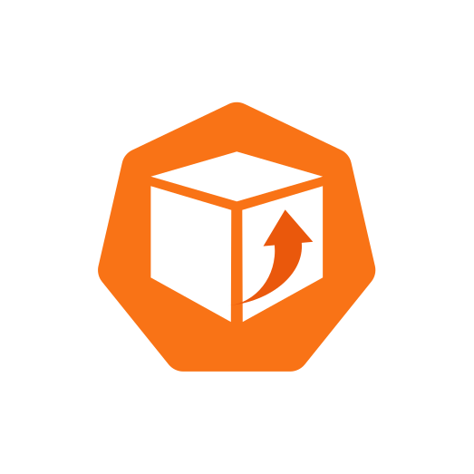

#  OptiPod

[![CI][ci-badge]][ci-link]
[![Lint][lint-badge]][lint-link]
[![Tests][tests-badge]][tests-link]
[![E2E Tests][e2e-badge]][e2e-link]
[![Release][release-badge]][release-link]
[![Go Version][go-badge]][go-link]
[](LICENSE)

OptiPod is an open-source Kubernetes operator that makes **explainable recommendations** for CPU and memory requests/limits, and can apply them when you explicitly opt in.

If you're new to operators or autoscaling: OptiPod is designed to be calm and safe to try.

- **Recommend mode is the safe way to start.**
- **Nothing mutates without opt-in** (you must explicitly choose `mode: Auto`).

## Why OptiPod exists

Kubernetes resources are often set once and never revisited. Teams want to tighten requests/limits, but hesitate because:

- GitOps controllers can fight with automated mutations.
- Memory tuning can cause OOMKills and noisy rollouts.
- It’s hard to trust a tool if you can’t explain its recommendations.

OptiPod exists to provide a GitOps-safe, policy-driven way to *recommend first*, then apply when you’re ready.

## What OptiPod will NOT do

- Will not mutate workloads unless explicitly configured
- Will not override GitOps ownership
- Will not blindly reduce memory
- Will not require a SaaS backend

## Quick Start (safe Recommend mode)

In **Recommend mode**:

- No resources are changed.
- No pods are restarted.
- Recommendations are written as annotations on individual workloads for review.
- Policy status shows aggregate counts (workloads discovered/processed) but not individual recommendations.

### 1) Install

**Recommended: Helm Installation**
```bash
# Install from the OCI registry (recommended)
helm install optipod oci://ghcr.io/sagart-cactus/charts/optipod \
  --version 1.4.1 \
  --namespace optipod-system \
  --create-namespace
```

**Alternative: kubectl**
```bash
# For ArgoCD/GitOps environments (webhook strategy)
kubectl apply -f https://github.com/Sagart-cactus/optipod/releases/latest/download/install-webhook.yaml

# For traditional Kubernetes environments (SSA strategy)
kubectl apply -f https://github.com/Sagart-cactus/optipod/releases/latest/download/install.yaml
```

**Automated installation script:**
```bash
curl -sSL https://raw.githubusercontent.com/Sagart-cactus/optipod/main/config/webhook/install.sh | bash
```

### 2) Create a minimal policy (Recommend mode)

Save as `optipod-policy.yaml`:

```yaml
apiVersion: optipod.optipod.io/v1alpha1
kind: OptimizationPolicy
metadata:
  name: safe-recommendations
  namespace: default
spec:
  mode: Recommend

  selector:
    workloadSelector:
      matchLabels:
        optimize: "true"

  metricsConfig:
    provider: metrics-server
    rollingWindow: 24h
    percentile: P90
    safetyFactor: 1.2

  resourceBounds:
    cpu:
      min: "100m"
      max: "4000m"
    memory:
      min: "128Mi"
      max: "8Gi"

  updateStrategy:
    allowInPlaceResize: true
    allowRecreate: false
    updateRequestsOnly: true
```

Apply it:

```bash
kubectl apply -f optipod-policy.yaml
```

### 3) Label a workload and review recommendations

```bash
kubectl label deployment my-app optimize=true
kubectl describe optimizationpolicy safe-recommendations -n default
# View individual workload recommendations:
kubectl get deployment my-app -o yaml | grep -A5 -B5 "optipod.io/recommendation"
```

Safety confirmation: as long as `spec.mode: Recommend`, OptiPod will not change workload specs.

## Where recommendations are stored

OptiPod stores recommendations in two places:

### Individual Workload Annotations
Each workload (Deployment, StatefulSet, DaemonSet) gets recommendation annotations:

```yaml
metadata:
  annotations:
    optipod.io/managed: "true"
    optipod.io/policy: "safe-recommendations"
    optipod.io/last-recommendation: "2025-01-04T10:30:00Z"
    optipod.io/recommendation.app-container.cpu-request: "250m"
    optipod.io/recommendation.app-container.memory-request: "512Mi"
    optipod.io/recommendation.app-container.cpu-limit: "500m"     # Present when updateRequestsOnly=false
    optipod.io/recommendation.app-container.memory-limit: "1Gi"   # Present when updateRequestsOnly=false
```

### Policy Status (Aggregate Only)
The OptimizationPolicy status shows aggregate counts, not individual recommendations:

```yaml
status:
  workloadsDiscovered: 150
  workloadsProcessed: 145
  workloadsByType:
    deployment: 120
    statefulset: 25
    daemonset: 5
  lastReconciliation: "2025-01-04T10:30:00Z"
```

This design keeps the policy status lightweight while making individual recommendations visible on each workload for GitOps workflows.

## What OptiPod actually does (high-level flow)

1. Discovers workloads selected by your policy (namespaces, labels, workload types)
2. Reads CPU/memory usage from your metrics backend
3. Computes recommendations (percentiles over a rolling window + safety factor)
4. Applies **policy-driven safety** (bounds, change controls, memory safeguards)
5. Either:
   - writes **explainable recommendations** as annotations on individual workloads (Recommend mode), or
   - applies changes via **Server-Side Apply (SSA)** (Auto mode)

## Key concepts / terminology

| Term | Meaning (one line) |
| --- | --- |
| Operator | A controller that continuously reconciles desired state in Kubernetes. |
| GitOps | A workflow where cluster state is driven from Git (e.g. ArgoCD/Flux). |
| Server-Side Apply (SSA) | Kubernetes apply mode that tracks field ownership to avoid conflicts. |
| VPA | Vertical Pod Autoscaler; recommends (and can apply) resource changes. |

## Operational modes

- **Recommend**: Compute and record recommendations; do not mutate workloads.
- **Auto**: Apply recommendations (within your safety policy) using the configured strategy.
- **Disabled**: Stop processing workloads under the policy.

## Update Strategies

OptiPod supports two strategies for applying resource recommendations:

### Webhook Strategy (Default)
**Best for**: ArgoCD, GitOps workflows, environments without SSA permissions

- ✅ **ArgoCD Compatible**: Works seamlessly with GitOps tools
- ✅ **No SSA Required**: Doesn't need Server Side Apply permissions  
- ✅ **Automatic Application**: Applies changes during pod creation
- ❌ **Infrastructure Required**: Needs webhook server and certificates

```yaml
spec:
  updateStrategy:
    strategy: webhook                    # Use webhook strategy
    rolloutStrategy: onNextRestart      # Control when changes take effect
```

### SSA Strategy (Traditional)
**Best for**: Direct Kubernetes API access, environments with full SSA permissions

- ✅ **Direct Updates**: Immediate API updates with Server Side Apply
- ✅ **No Infrastructure**: No additional components required
- ❌ **ArgoCD Conflicts**: May conflict with GitOps tools
- ❌ **SSA Required**: Needs Server Side Apply permissions

```yaml
spec:
  updateStrategy:
    strategy: ssa                       # Use SSA strategy
    useServerSideApply: true           # Enable SSA features
```

## Safety model

OptiPod is built around conservative defaults and explicit, policy-driven controls:

- **Policy-driven safety**: min/max bounds, safety factors, and (where configured) change-rate limits.
- **Conservative memory handling**: avoids “blind” memory reductions; requires explicit bounds/constraints.
- **GitOps-safe**: supports both **webhook strategy** (ArgoCD compatible) and **Server-Side Apply (SSA)** for different environments.
- **Explainable recommendations**: usage window, percentile choice, and safety margin are visible before applying.
- **Update strategy control**: allow/disallow in-place resize; block disruptive recreation unless you opt in.

## OptiPod vs VPA comparison

Legend: ✅ supported, ❌ not supported, ⚠️ supported with caveats.

| Capability | OptiPod | Kubernetes VPA |
| --- | --- | --- |
| GitOps-safe (ArgoCD compatible) | ✅ | ❌ |
| Server-Side Apply (SSA) support | ✅ | ❌ |
| Safe by default (Recommend mode) | ✅ | ⚠️ |
| Explainable recommendations | ✅ | ⚠️ |
| Policy-driven safety | ✅ | ⚠️ |
| Multiple update strategies | ✅ | ❌ |

⚠️ Typically means you *can* achieve the outcome, but it’s easier to run into GitOps conflicts and/or less predictable rollouts depending on configuration and workload constraints.

## Who OptiPod is for

- Platform teams running GitOps-managed clusters
- SREs who want safer, Recommend mode first workflows
- FinOps partners who need guardrails and visibility (without a SaaS dependency)
- Teams who want to start with recommendations and adopt automation gradually

## Metrics & observability

- Metrics backends: `metrics-server` and `prometheus`
- Exposes Prometheus metrics from the controller
- Emits Kubernetes events for important actions and failures
- Writes recommendations as annotations on workloads and aggregate results to `OptimizationPolicy` status

## Estimate impact before switching to Auto

Before you change a policy to `mode: Auto`, you can generate a report that summarizes the *replica-weighted* impact (total CPU/memory request deltas across pods) based on OptiPod’s recommendations.

This is especially useful to answer: “If I opt in to Auto, what will change, and by how much?”

Generate an HTML report:

```bash
curl -fsSL https://raw.githubusercontent.com/Sagart-cactus/optipod/main/optipod-recommendation-report.sh -o optipod-recommendation-report.sh
chmod +x optipod-recommendation-report.sh
./optipod-recommendation-report.sh -o html -f optipod-impact.html
```

Generate a JSON report for programmatic analysis:

```bash
./optipod-recommendation-report.sh -o json -f optipod-impact.json
```

The report only includes workloads that have OptiPod recommendation annotations (generated in Recommend mode), and highlights warnings (for example: when `updateRequestsOnly=true` but recommended requests would exceed existing limits).

**How the impact report works:**
- Scans all workloads in the cluster for OptiPod recommendation annotations
- Consolidates individual workload recommendations into aggregate totals
- Calculates replica-weighted impact (recommendation delta × number of pods)
- Provides both per-workload details and cluster-wide summaries
- Available in JSON format for automation or HTML for human review


## Project status

OptiPod has core functionality implemented and tested, and is in active development.

- **Production-ready features**
  - **GitOps-safe Server-Side Apply (SSA)**: OptiPod claims ownership only of CPU/memory request/limit fields.
  - **Multiple operational modes**: Recommend / Auto / Disabled.
  - **Policy-driven safety**: bounds, safety factors, and controlled application strategies.
  - **Explainable recommendations**: visible inputs and margins before applying.
  - **Observability**: Prometheus metrics, Kubernetes events, and detailed policy status.

- **Work in progress**
  - Per-policy metrics provider selection (currently configured globally)
  - Custom metrics provider plugin framework

- **Documentation**
  - [Installation Guide](docs/INSTALLATION.md)
  - [Example Policies](docs/EXAMPLES.md)
  - [Impact Report](docs/IMPACT_REPORT.md)
  - [CRD Reference](docs/CRD_REFERENCE.md)
  - [Prometheus Setup](docs/PROMETHEUS_SETUP.md)
  - [ArgoCD Integration](docs/ARGOCD_INTEGRATION.md)
  - [Pre-commit Setup](docs/PRE_COMMIT_SETUP.md)
  - [Webhook Troubleshooting](docs/WEBHOOK_TROUBLESHOOTING.md)
  - [Webhook Examples](docs/WEBHOOK_EXAMPLES.md)

- Docs: `docs/` (source) and `website/docs/` (rendered site)
- Roadmap: [ROADMAP.md](ROADMAP.md)

## Contributing & governance

- Contributing guide: [CONTRIBUTING.md](CONTRIBUTING.md)
- Governance: [GOVERNANCE.md](GOVERNANCE.md)
- Code of Conduct: [CODE_OF_CONDUCT.md](CODE_OF_CONDUCT.md)

### Quick Start for contributors

```bash
git clone https://github.com/Sagart-cactus/optipod.git
cd optipod
make setup-pre-commit
make test
```

### Building from source (development)

```bash
make build
make run
```

## Roadmap

See [ROADMAP.md](ROADMAP.md) for planned work and explicit non-goals.

## License

Apache 2.0. See [LICENSE](LICENSE).

## Final safety note

Start in **Recommend mode**, set conservative bounds, and validate recommendations in a non-production environment before enabling `mode: Auto`.

[ci-badge]: https://github.com/Sagart-cactus/optipod/actions/workflows/ci.yml/badge.svg
[ci-link]: https://github.com/Sagart-cactus/optipod/actions/workflows/ci.yml
[lint-badge]: https://github.com/Sagart-cactus/optipod/actions/workflows/lint.yml/badge.svg
[lint-link]: https://github.com/Sagart-cactus/optipod/actions/workflows/lint.yml
[tests-badge]: https://github.com/Sagart-cactus/optipod/actions/workflows/test.yml/badge.svg
[tests-link]: https://github.com/Sagart-cactus/optipod/actions/workflows/test.yml
[e2e-badge]: https://github.com/Sagart-cactus/optipod/actions/workflows/e2e.yml/badge.svg
[e2e-link]: https://github.com/Sagart-cactus/optipod/actions/workflows/e2e.yml
[release-badge]: https://github.com/Sagart-cactus/optipod/actions/workflows/release.yml/badge.svg
[release-link]: https://github.com/Sagart-cactus/optipod/actions/workflows/release.yml
[go-badge]: https://img.shields.io/github/go-mod/go-version/Sagart-cactus/optipod
[go-link]: https://github.com/Sagart-cactus/optipod
