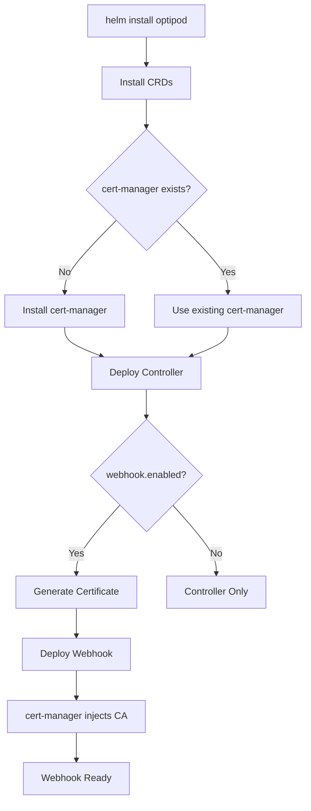

# OptipPod Helm Chart Architecture

## Overview

This document explains the architectural decisions behind the OptipPod Helm chart structure and compares different approaches.

## Current Architecture: Unified Single Chart ⭐

The OptipPod Helm chart is a **unified, batteries-included chart** that installs:
- ✅ **CRDs** (CustomResourceDefinitions)
- ✅ **Controller** (Operator that reconciles OptimizationPolicies)
- ✅ **Webhook** (Optional mutating admission webhook)
- ✅ **cert-manager** (Auto-installed if not present)

### Chart Structure

```
charts/optipod/
├── Chart.yaml                      # Chart metadata + cert-manager dependency
├── values.yaml                     # Configuration options
├── crds/                           # ⚠️ Special directory
│   └── optimizationpolicies.yaml  # Installed first, never deleted
├── charts/                         # Downloaded dependencies
│   └── cert-manager-v1.14.2.tgz   # Auto-installed if needed
└── templates/
    ├── _helpers.tpl                # Template functions
    ├── NOTES.txt                   # Post-install guidance
    │
    ├── serviceaccount.yaml         # Controller + Webhook SAs
    ├── rbac.yaml                   # All RBAC resources
    │
    ├── controller-deployment.yaml  # Main operator controller
    ├── metrics-service.yaml        # Prometheus metrics
    ├── servicemonitor.yaml         # Prometheus ServiceMonitor
    │
    ├── webhook-deployment.yaml     # Optional webhook server
    ├── webhook-service.yaml        # Webhook service
    ├── webhook-config.yaml         # MutatingWebhookConfiguration
    ├── webhook-pdb.yaml            # PodDisruptionBudget
    ├── webhook-networkpolicy.yaml  # NetworkPolicy
    │
    ├── issuer.yaml                 # cert-manager Issuer
    └── certificate.yaml            # cert-manager Certificate
```

### Component Relationships



### Installation Flow

```bash
$ helm install optipod charts/optipod -n optipod-system --create-namespace

# What happens:
# 1. Helm checks if CRDs exist (from crds/ directory)
# 2. Installs/updates CRDs (never deleted on uninstall)
# 3. Checks if cert-manager exists (lookup function)
# 4. Installs cert-manager if needed (as subchart)
# 5. Deploys controller deployment
# 6. If webhook enabled: deploys webhook + certificate
# 7. cert-manager generates certificate and injects CA bundle
# 8. All components ready
```

## Alternative Architectures (NOT Implemented)

### Option A: Separate Charts (Rejected ❌)

```
charts/
├── optipod-crds/          # CRDs only
├── optipod-controller/    # Controller only
└── optipod-webhook/       # Webhook only
```

**Why Rejected:**
- ❌ **Complex installation**: Multiple commands required
- ❌ **Version compatibility**: Users must manage compatibility
- ❌ **Maintenance burden**: 3 charts to keep in sync
- ❌ **Poor UX**: Users need to understand component relationships
- ❌ **Rollback complexity**: Must rollback 3 charts separately

**Installation would look like:**
```bash
# Too complex for users!
helm install optipod-crds charts/optipod-crds -n optipod-system
helm install optipod-controller charts/optipod-controller -n optipod-system
helm install optipod-webhook charts/optipod-webhook -n optipod-system

# Version compatibility nightmare
helm upgrade optipod-controller charts/optipod-controller --version 0.2.0
# ⚠️  Will this work with CRDs v0.1.0? User must figure out!
```

### Option B: Operator + Separate Webhook Chart (Rejected ❌)

```
charts/
├── optipod/          # CRDs + Controller
└── optipod-webhook/  # Webhook only
```

**Why Rejected:**
- ❌ **Artificial separation**: Webhook is core functionality, not addon
- ❌ **Confusion**: When to install webhook chart?
- ❌ **Still complex**: 2 charts to manage
- ❌ **No benefit**: Webhook can be disabled via values.yaml

### Option C: CRDs in Templates (Rejected ❌)

Put CRDs in `templates/` instead of `crds/` directory.

**Why Rejected:**
- ❌ **Dangerous**: CRDs deleted on `helm uninstall` (data loss risk!)
- ❌ **Upgrade issues**: CRD updates happen automatically (can break things)
- ❌ **Against Helm best practices**: CRDs should be in `crds/` directory

## Why Unified Chart is Best ✅

### 1. **Industry Alignment**

Most successful Kubernetes operators use unified charts:

| Project | Architecture | Reason |
|---------|-------------|---------|
| **cert-manager** | Unified chart | CRDs + Controller + Webhook in one |
| **prometheus-operator** | Unified chart | CRDs + Operator in one |
| **istio** | Unified base + components | But moving to unified |
| **argocd** | Unified chart | All components in one |
| **vault** | Unified chart | Operator + CRDs in one |

### 2. **User Experience**

```bash
# ✅ Unified Chart (What we have)
helm install optipod optipod/optipod -n optipod-system --create-namespace

# ❌ Separate Charts (Alternative)
helm install optipod-crds optipod/optipod-crds -n optipod-system
helm install optipod-controller optipod/optipod-controller -n optipod-system
helm install optipod-webhook optipod/optipod-webhook -n optipod-system
```

Winner: **Unified Chart** 🏆

### 3. **Version Compatibility**

```bash
# ✅ Unified Chart - Guaranteed compatible
helm install optipod optipod/optipod --version 0.2.0
# All components are tested together

# ❌ Separate Charts - Manual compatibility management
helm install optipod-crds optipod/optipod-crds --version 0.2.0
helm install optipod-controller optipod/optipod-controller --version 0.2.1
helm install optipod-webhook optipod/optipod-webhook --version 0.1.5
# ⚠️  Will these versions work together? Unknown!
```

Winner: **Unified Chart** 🏆

### 4. **Rollback Safety**

```bash
# ✅ Unified Chart - Atomic rollback
helm rollback optipod
# Everything rolls back together

# ❌ Separate Charts - Manual rollback
helm rollback optipod-controller
helm rollback optipod-webhook  # In what order?
# ⚠️  CRDs don't rollback (by design)
```

Winner: **Unified Chart** 🏆

### 5. **Configuration Management**

```bash
# ✅ Unified Chart - Single values file
cat > values.yaml <<EOF
webhook:
  enabled: true
controller:
  replicas: 3
certManager:
  install: auto
EOF
helm install optipod optipod/optipod -f values.yaml

# ❌ Separate Charts - Multiple values files
# Must maintain values-controller.yaml, values-webhook.yaml, etc.
```

Winner: **Unified Chart** 🏆

### 6. **Maintenance Burden**

| Task | Unified Chart | Separate Charts |
|------|--------------|-----------------|
| Release new version | 1 chart update | 3 chart updates |
| Update dependencies | 1 Chart.yaml | 3 Chart.yaml files |
| Test compatibility | 1 test suite | 3x combinations |
| Document installation | 1 guide | 3 guides + ordering |
| CI/CD pipelines | 1 pipeline | 3 pipelines |

Winner: **Unified Chart** 🏆

## Advanced Use Cases

### "But I only want the controller!"

```bash
# ✅ Still easy with unified chart
helm install optipod optipod/optipod \
  --set webhook.enabled=false \
  --set certManager.install=false
```

### "But I want to manage CRDs separately!"

```bash
# ✅ Helm provides this out of the box
helm install optipod optipod/optipod --skip-crds

# Or manually install CRDs first
kubectl apply -f charts/optipod/crds/

# Then install chart without CRDs
helm install optipod optipod/optipod --skip-crds
```

### "But I need different upgrade schedules!"

```bash
# ✅ Use different releases
helm install optipod-prod optipod/optipod -n prod
helm install optipod-staging optipod/optipod -n staging --version 0.2.0-beta

# Or use different values per environment
helm install optipod optipod/optipod -f prod-values.yaml
```

## CRD Management Best Practices

### Why CRDs are in `crds/` Directory

Helm treats files in `crds/` specially:

1. **Installed first** - Before any templates
2. **Never deleted** - On `helm uninstall` (prevents data loss)
3. **Never upgraded** - Requires manual intervention (safety)
4. **Can't be templated** - No `{{ .Values }}` (deterministic)

### Upgrading CRDs

CRDs in the `crds/` directory are NOT automatically upgraded. This is intentional for safety.

**To upgrade CRDs:**

```bash
# Option 1: Manual kubectl apply
kubectl apply -f charts/optipod/crds/

# Option 2: Replace during upgrade
helm upgrade optipod optipod/optipod --force

# Option 3: Use CRD upgrade job (advanced)
# We can add this later if needed
```

### CRD Deletion Policy

CRDs have this annotation:
```yaml
metadata:
  annotations:
    helm.sh/resource-policy: keep
```

This means:
- ✅ CRDs persist after `helm uninstall`
- ✅ Existing CR (Custom Resources) are preserved
- ✅ No accidental data loss

**To completely remove CRDs:**
```bash
# Uninstall chart
helm uninstall optipod -n optipod-system

# Manually delete CRDs (and all CRs!)
kubectl delete crd optimizationpolicies.optipod.optipod.io

# WARNING: This deletes all OptimizationPolicy resources!
```

## Component Independence

Even in a unified chart, components are loosely coupled:

### Controller (Always Installed)
- Runs independently
- Reconciles OptimizationPolicy CRs
- Applies SSA (Server-Side Apply) strategy
- Does NOT require webhook

### Webhook (Optional)
- Controlled by `webhook.enabled` flag
- Requires cert-manager
- Provides mutating admission webhook strategy
- Controller can run without it

### cert-manager (Auto-managed)
- Controlled by `certManager.install` flag
- Only needed if webhook enabled
- Auto-detected and installed if missing

```yaml
# Example: Controller only (no webhook)
webhook:
  enabled: false
certManager:
  install: false

# Example: Full stack
webhook:
  enabled: true
certManager:
  install: auto  # Install if not found
```

## Migration Path (If Needed Later)

If we ever need to split the chart, the migration path is clear:

```yaml
# Current: Unified
helm install optipod optipod/optipod

# Future: Could provide both
helm install optipod optipod/optipod  # Unified (recommended)
# OR
helm install optipod optipod/optipod-full  # Alias
# OR
helm install optipod-operator optipod/optipod-operator  # Split version
```

**But**: Start simple. Split only if we have concrete reasons (e.g., large enterprise customers needing modular deployment).

## Comparison with Other Tools

### vs Kustomize

| Feature | Helm Chart | Kustomize |
|---------|-----------|-----------|
| Templating | ✅ Go templates | ❌ Patching only |
| Versioning | ✅ Chart versions | ❌ Git commits |
| Rollback | ✅ `helm rollback` | ❌ Manual |
| Dependencies | ✅ Chart.yaml | ❌ Manual |
| Release management | ✅ Built-in | ❌ Manual |
| Configuration | ✅ values.yaml | ⚠️  Overlays |

**Decision**: Helm for users, keep Kustomize for development.

### vs Operator SDK/OLM

| Feature | Helm | OLM |
|---------|------|-----|
| Learning curve | ✅ Gentle | ❌ Steep |
| Enterprise adoption | ✅ Universal | ⚠️  OpenShift-focused |
| Dependency management | ✅ Native | ✅ Native |
| Upgrade automation | ⚠️  Manual approval | ✅ Automatic |

**Decision**: Start with Helm, add OLM support later if needed.

## Conclusion

✅ **Unified Chart is the right choice for OptipPod**

**Reasons:**
1. ✅ Better user experience (single command)
2. ✅ Guaranteed version compatibility
3. ✅ Industry standard pattern
4. ✅ Lower maintenance burden
5. ✅ Easier testing and CI/CD
6. ✅ Can always split later if needed
7. ✅ Follows cert-manager's successful pattern

**The chart provides:**
- 🎯 Simple installation: `helm install optipod optipod/optipod`
- 🔧 Flexible configuration: Enable/disable components via values
- 🔐 Safe CRD management: CRDs never deleted accidentally
- 📦 Auto-dependency management: cert-manager installed if needed
- 🚀 Production-ready: RBAC, security, HA, observability

**Next Steps:**
1. Keep unified architecture
2. Add more configuration options as needed
3. Consider OLM bundle for OpenShift (future)
4. Only split if concrete need arises (unlikely)

## References

- [Helm Best Practices - CRDs](https://helm.sh/docs/chart_best_practices/custom_resource_definitions/)
- [cert-manager Chart Architecture](https://github.com/cert-manager/cert-manager/tree/master/deploy/charts/cert-manager)
- [Prometheus Operator Chart](https://github.com/prometheus-operator/prometheus-operator/tree/main/charts/kube-prometheus-stack)
- [Operator SDK - Helm](https://sdk.operatorframework.io/docs/building-operators/helm/)
