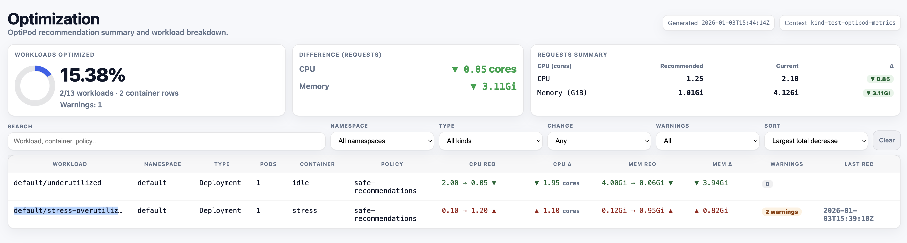

# Scripts Directory

This directory contains utility scripts for the OptipPod project.

## 📋 Available Scripts

### `optipod-recommendation-report.sh`

A comprehensive script that generates HTML or JSON reports of all OptiPod recommendations across your cluster. This helps you understand the impact of recommendations before switching to Auto mode.

#### 🚀 Usage

```bash
# Generate HTML report
./scripts/optipod-recommendation-report.sh -o html -f optipod-recommendations.html

# Generate JSON report for automation
./scripts/optipod-recommendation-report.sh -o json -f optipod-recommendations.json

# Filter by namespace
./scripts/optipod-recommendation-report.sh -o html -f report.html --namespace production

# Filter by workload types
./scripts/optipod-recommendation-report.sh -o html -f report.html --kinds deploy,sts
```

#### ✅ What it shows

1. **Summary Cards**
   - Percentage of workloads with recommendations
   - Total CPU and memory delta (replica-weighted)
   - Aggregate impact across all pods

2. **Detailed Table**
   - Current vs recommended resources per container
   - Replica-weighted impact calculations
   - Warnings for potential issues
   - Sortable and filterable interface

3. **Warnings**
   - CPU/memory requests exceeding current limits
   - `updateRequestsOnly` conflicts
   - Other potential issues

#### 🔧 Features

- **Multiple Output Formats**: HTML for humans, JSON for automation
- **Replica-Weighted Calculations**: Shows total cluster impact
- **Interactive HTML**: Sort, filter, and search recommendations
- **Namespace Filtering**: Focus on specific namespaces
- **Workload Type Filtering**: Analyze specific workload types
- **Visual Summary**: Cards and charts for quick understanding

#### 📝 Example Output

The HTML report includes:
- Visual summary cards showing optimization percentage
- CPU and memory delta calculations
- Interactive table with all workload recommendations
- Filtering by namespace, workload type, and change direction
- Warnings for potential issues



#### 🎯 Use Cases

1. **Before Switching to Auto Mode**
   - Understand what will change
   - Estimate cluster-wide impact
   - Identify potential issues

2. **Regular Reviews**
   - Weekly/monthly optimization reviews
   - Track recommendation trends
   - Share with team for approval

3. **Automation**
   - Generate JSON for CI/CD pipelines
   - Integrate with monitoring systems
   - Automated impact analysis

#### 🛠️ Prerequisites

- `kubectl` configured to access your cluster
- `jq` installed locally
- OptiPod running in Recommend mode with recommendations generated

#### 📊 Report Sections

**Summary Cards:**
- Workloads Optimized: Shows percentage and counts
- Difference (Requests): Total CPU/memory delta
- Requests Summary: Current vs recommended totals

**Detailed Table:**
- Workload, namespace, type, pod count
- Container name and managing policy
- Current → recommended resources
- Delta calculations (per-pod and total)
- Warnings and last recommendation time

**Filters:**
- Search by workload/container/policy name
- Filter by namespace
- Filter by workload type
- Filter by change direction (increase/decrease)
- Filter by warnings
- Sort by various criteria

#### 🔄 Integration

This script is referenced in:
- Main README.md for impact estimation
- docs/IMPACT_REPORT.md for detailed usage
- Website documentation for user guidance

### `ci-checks-local.sh`

A comprehensive script that mirrors the exact GitHub Actions pre-commit checks locally. This ensures consistency between local development and CI environment.

#### 🚀 Usage

```bash
# Run via Makefile (recommended)
make ci-checks-local

# Or run directly
./scripts/ci-checks-local.sh
```

#### ✅ What it checks

1. **Code Formatting Check**
   - Go formatting (`gofmt`)
   - Go imports (`goimports`)

2. **Linting Check**
   - golangci-lint with same version as CI (v2.7.2)

3. **Security Scan**
   - detect-secrets baseline validation

4. **YAML Validation**
   - yamllint with project configuration

5. **Pre-commit Hooks**
   - All configured pre-commit hooks (excluding markdownlint)

#### 🔧 Features

- **Version Consistency**: Uses exact same tool versions as GitHub Actions
- **Automatic Tool Installation**: Installs missing tools automatically
- **Path Resolution**: Handles different tool installation locations
- **Colored Output**: Clear success/error indicators
- **Detailed Error Reporting**: Shows exactly what needs to be fixed
- **Secrets Baseline Management**: Automatically handles baseline updates

#### 🎯 Benefits

- **Prevent CI Failures**: Catch issues before pushing to GitHub
- **Faster Development**: No need to wait for CI to see failures
- **Consistent Environment**: Same checks locally and in CI
- **Developer Friendly**: Clear instructions on how to fix issues

#### 📝 Example Output

```
🚀 Running Local CI Checks (GitHub Actions Mirror)

========================================
 📝 Code Formatting Check
========================================

[SUCCESS] Go formatting check passed
[SUCCESS] Go imports check passed

========================================
 🔍 Linting Check
========================================

[SUCCESS] Linting check passed

========================================
 🔒 Security Scan
========================================

[SUCCESS] Security scan passed

========================================
 📄 YAML Validation
========================================

[SUCCESS] YAML validation completed (warnings are acceptable for K8s manifests)

========================================
 🪝 Pre-commit Hooks
========================================

[SUCCESS] Pre-commit hooks passed

========================================
 📊 Summary
========================================

🎉 All CI checks passed! Your code is ready for GitHub Actions.

✅ Code Formatting Check
✅ Linting Check
✅ Security Scan
✅ YAML Validation
✅ Pre-commit Hooks
```

#### 🛠️ Troubleshooting

If checks fail, the script provides specific commands to fix issues:

```bash
make format          # Fix Go formatting and imports
make lint-fix        # Fix linting issues automatically
git add .secrets.baseline  # Update secrets baseline if needed
```

#### 🔄 Integration

This script is integrated into the project's Makefile as `make ci-checks-local` for easy access. It's recommended to run this before committing changes to ensure all CI checks will pass.